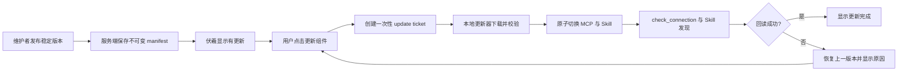
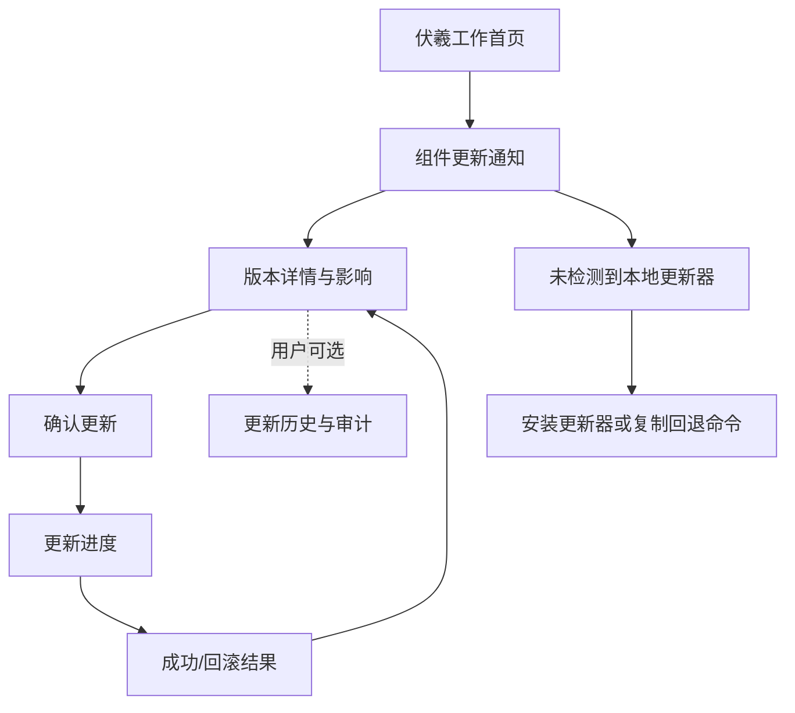
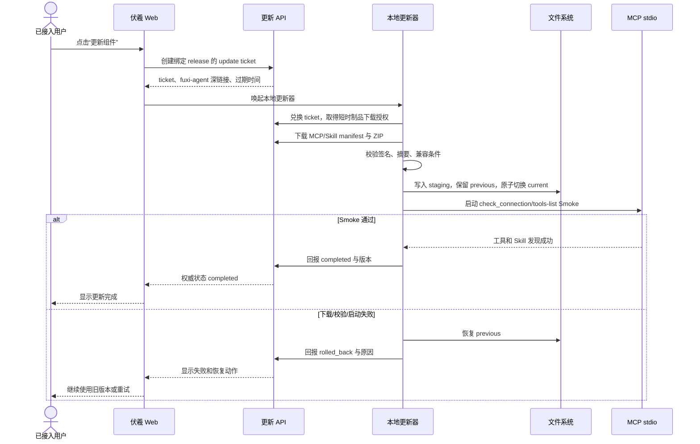
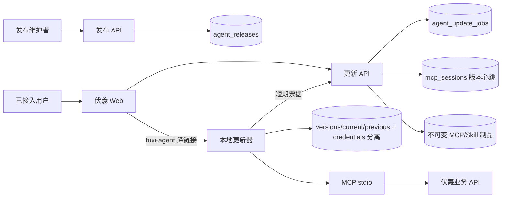
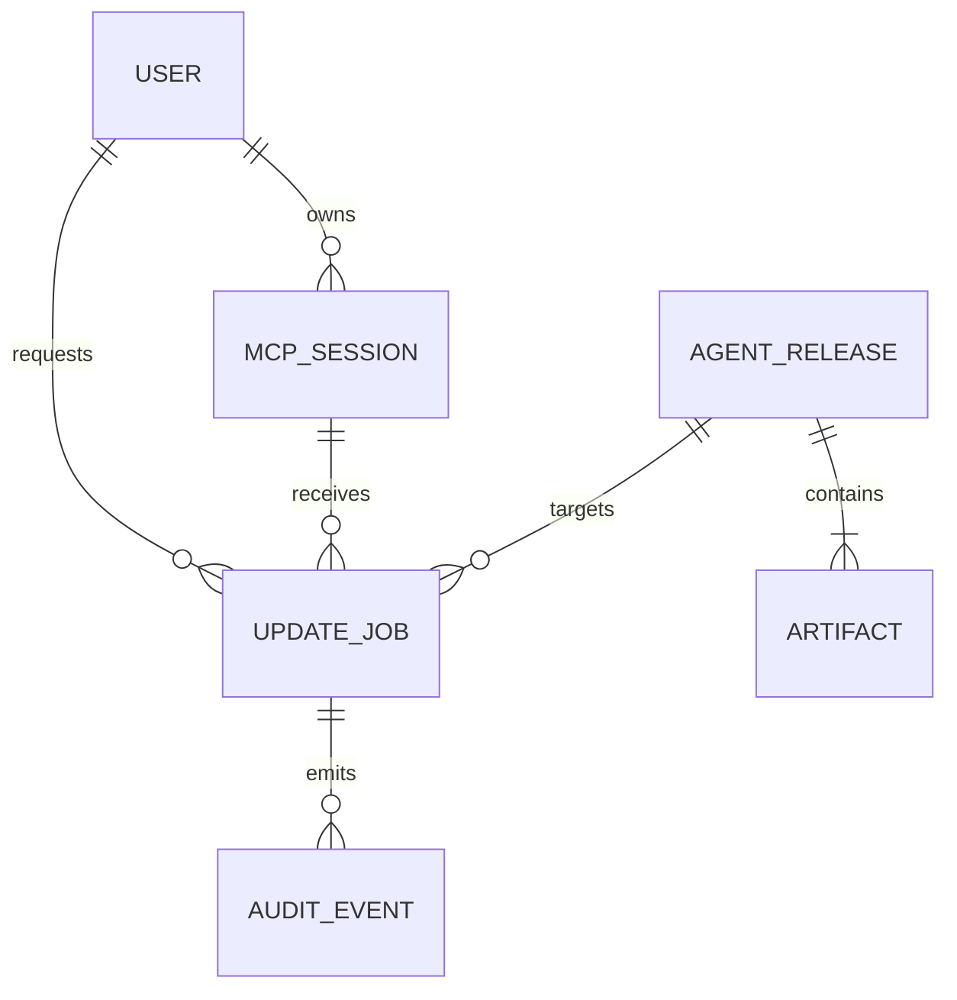
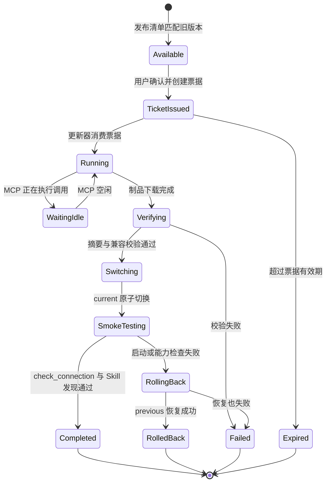

# 伏羲 MCP 与 Skill 主动更新全量详细设计

> 设计基线：2026-08-21
> 关联原型：[index.html](./index.html)
> 设计摘要：[DESIGN_SUMMARY.md](./DESIGN_SUMMARY.md)
> 状态：MVP 设计完成，代码实现未开始

## 1. 文档地位

本文是“首次接入后如何更新本地 MCP stdio 与 Skill”的权威设计，不改变首次接入、任务码和原型候选采纳的既有边界。受众是产品负责人、平台后端、MCP/Skill 维护者和实现该功能的 Agent。本文区分已验证事实、已确认决策、设计目标与尚未完成的真实环境证据；本地原型和静态校验不能代替 Windows 深链接、真实设备更新和生产验收。

当前事实包括：伏羲已有 `/api/integrations/agent-bootstrap`、Skill/MCP ZIP 分发、MCP stdio 本地凭据文件、可撤销设备会话和动态 Skill 能力缓存；连接码只负责首次兑换。新机制只在这些边界上增加版本清单、更新票据、更新作业和本地原子替换。

## 2. 第一性原理

### 2.1 不可约的用户结果

已完成首次接入的用户看到伏羲发布了新版本后，点击一次“更新组件”，本地 MCP 与 Skill 完成安全更新且原有会话和工作目录继续可用，不再让 AI 重复执行完整接入。

### 2.2 产品定位

这是“版本通知与本地更新编排”，不是远程控制用户电脑、不是新的登录体系，也不是后台自动执行任意脚本。伏羲拥有发布事实和更新作业状态；本地更新器只执行经过校验的固定更新流程。

### 2.3 设计原则

- 首次连接与日常更新分离：连接码只做一次设备建立，更新不再要求 AI 重新接入。
- 用户确认才发生本地写入：通知可以主动出现，安装不能静默发生。
- 版本制品不可变：服务端发布清单、摘要和兼容条件一经发布不原地修改。
- 更新失败必须可恢复：任何切换失败都回到上一版本，不能留下半套 MCP/Skill。
- 凭据与版本目录分离：更新器绝不覆盖 `FUXI_CREDENTIALS_FILE`、用户配置或业务项目。
- 先证明 MVP 闭环：稳定渠道、单设备、单击确认、原子替换和回滚先于多渠道灰度与无人值守。

## 3. 已确认决策

| ID | 决策 | 确认答案 | 理由 | 影响 |
|---|---|---|---|---|
| D-01 | 不可约结果 | 已接入用户可在伏羲内完成 MCP/Skill 更新 | 重复接入是当前体验成本，不是用户价值 | 新入口围绕更新，不复用完整接入提示词 |
| D-02 | 事实源 | 服务端发布清单权威，本地安装清单记录设备事实 | UI 不能仅凭缓存声称已更新 | 需要版本回报和权威回读 |
| D-03 | 触达方式 | 服务器发布版本，伏羲平台检测并通知 | 浏览器不能安全直接执行本地脚本 | MVP 先采用短轮询，预留 SSE，不把实时推送当闭环前置条件 |
| D-04 | 人工决定点 | 用户点击确认后才生成 update ticket 并启动本地更新器 | 防止用户正在用 MCP 时被强制重启 | 更新通知和更新执行分离 |
| D-05 | 本地执行边界 | 首次接入安装并注册本地更新器，浏览器通过 `fuxi-agent://` 唤起 | 浏览器安全模型不允许任意脚本执行 | 缺少更新器时必须有可理解的回退 |
| D-06 | 版本绑定 | MCP stdio 与 Skill 按兼容发布单元更新 | 只更新一半会造成工具/知识不匹配 | manifest 要有两者版本和兼容矩阵 |
| D-07 | 凭据策略 | update ticket 短期、单次、绑定用户/设备/发布版本 | refresh token 不能进入 URL 或浏览器脚本 | 更新器通过票据换取短时下载授权 |
| D-08 | 回滚策略 | 保留上一套版本，切换后做 Smoke，失败自动恢复 | MCP 无法启动是最高成本失败 | 版本目录不可变，`current` 只做原子指针 |
| D-09 | MVP 截断 | 稳定渠道、单设备、手动确认、Windows 先行 | 先验证“无需重新接入”是否成立 | 灰度、静默、macOS/Linux 守护进程后置 |

## 4. MVP 范围

MVP 只证明一个闭环：服务端发布一个兼容的 MCP/Skill 版本，已接入用户收到通知，点击后本地更新器完成校验、切换、回读和失败恢复。

- 所有权：发布清单和更新作业由伏羲服务端持有；文件替换由用户设备上的更新器执行。
- 最高成本失败：MCP 进程无法启动或 Skill 目录被半替换；必须保留上一版本并能继续使用。
- 对应验收：场景 A 正常更新、场景 B 更新失败回滚、场景 F 真实环境。

### 4.1 MVP 必须有

- `agent_releases` 发布清单：MCP 版本、Skill 版本、摘要、下载地址、最低运行时、兼容 API 和发布渠道。
- MCP 会话在启动/刷新时上报本地版本，伏羲能计算“已是最新/有更新/状态未知”。
- 用户侧更新通知、版本详情、确认按钮、阶段进度和结果回读。
- 一次性 update ticket、`fuxi-agent://update` 深链接和无深链接时的命令行回退。
- 独立本地更新器：临时下载、SHA-256/签名校验、备份、原子切换、Smoke、回滚、结果回报。

### 4.2 MVP 明确不做

- 不做浏览器直接执行 PowerShell/Node，不把任意脚本内容塞进深链接。
- 不做无感后台更新、定时自动重启 MCP、跨设备批量强推。
- 不做多渠道灰度、复杂审批流、在线修改 Skill、Node.js 自动升级。
- 不做服务端浏览器自动化；MCP/Skill 更新验证只做本地进程和能力发现 Smoke。

## 5. 用户、角色与权限

### 5.1 角色

- **发布维护者**：发布或撤回稳定渠道的不可变版本，不能读取用户 refresh token。
- **已接入用户**：查看自己设备的更新状态，为自己选定设备创建更新票据并确认更新。
- **本地更新器**：只执行绑定用户/设备/版本的票据，不拥有平台管理权限。
- **伏羲服务**：计算可用版本、签发票据、保存作业状态和审计记录。

### 5.2 固定权限矩阵

| 操作 | 发布维护者 | 已接入用户 | 本地更新器 | 伏羲服务 |
|---|---:|---:|---:|---:|
| 查看稳定版本摘要 | ✓ | ✓ | 通过票据 | ✓ |
| 发布/撤回版本 | ✓ | — | — | 执行校验 |
| 查看自己的设备 | — | ✓ | 仅自身 | ✓ |
| 创建更新票据 | — | ✓ | — | ✓ |
| 下载绑定制品 | — | — | 票据范围内 | ✓ |
| 原子替换本地文件 | — | — | ✓ | — |
| 回滚本地版本 | — | 用户确认 | ✓ | 记录结果 |

### 5.3 权限不变量

更新票据同时绑定 `userId`、`sessionId/deviceId`、`releaseId` 和过期时间；票据消费后不能被第二台设备使用。用户只能更新自己的设备会话，发布维护者不能借此远程执行用户设备上的命令。

## 6. 用户旅程与信息架构

默认路径必须让已接入用户在伏羲首页完成“知道有更新、确认更新、看到结果”三步，版本文件和实现机制按需展开。

- 默认落点：登录后的伏羲工作首页右上角通知和“组件管理”入口。
- 渐进披露：默认只显示目标版本、更新内容、是否需要重启；SHA-256、Node 版本和文件清单放在“查看详情”。
- 角色差异：普通用户只看到自己的设备；管理员可看到发布渠道和全局失败统计，但不能替用户点击更新。
- 对应原型：`index.html` 的 overview、progress、rules 三个视图及四个状态弹窗。

## 7. 核心交互设计

### 7.1 页面和状态

| 页面/状态 | 用户问题 | 主操作 | 次要信息 | 禁止出现 |
|---|---|---|---|---|
| 工作首页 | 有什么需要我处理 | 更新组件 | 版本、设备名、重启提示 | “后台已自动更新” |
| 版本详情 | 更新什么、是否安全 | 确认更新 | 变更摘要、兼容条件、大小 | 暴露 token 或内部路径 |
| 更新进度 | 现在进行到哪一步 | 等待/查看日志 | 下载、校验、切换、Smoke | 在切换前显示完成 |
| 成功结果 | 是否真的可用 | 继续使用 | MCP/Skill 版本、会话保留 | 仅凭 HTTP 200 宣称成功 |
| 失败结果 | 发生了什么、怎么恢复 | 重试或继续旧版 | 回滚版本、错误码 | 删除上一版本 |

### 7.2 关键交互时序

成功只在本地更新器回报并由服务端读回作业状态后反馈；浏览器点击本身不等于更新成功。

- 等待点：深链接唤起、下载、校验、MCP 重启和本地 Smoke，全部显示进度。
- 人工决定点：用户点击确认和失败后是否重试；发布维护者负责发布，不替用户更新。
- 对应接口：§14；对应验收：§22 场景 A、B、E。

## 8. 目标系统架构

权威状态只有服务端发布清单和更新作业；本地版本是设备事实，浏览器只展示投影，更新器是受票据约束的不可信执行边界。

- 事实源：`agent_releases` 是发布权威，`agent_update_jobs` 是作业权威，`mcp_sessions` 是设备上报事实。
- 信任边界：浏览器和本地更新器均不可信；update ticket 限定权限；refresh token 永不进入更新 URL。
- 外部依赖：操作系统深链接、Node.js、网络下载和 AI 客户端的 MCP 配置机制；缺失时提供回退。
- 故障隔离：更新器失败只影响本地组件，服务端和正式原型不被改写；旧版本目录保留。

### 8.1 组件职责

| 组件 | 负责 | 不负责 | 权威数据 |
|---|---|---|---|
| 伏羲 Web | 通知、确认、进度、结果 | 执行本地脚本、保存 refresh token | 作业状态投影 |
| 更新 API | 发布清单、票据、下载授权、作业回读 | 操作用户文件、远程执行命令 | releases/jobs |
| MCP stdio | 上报版本、接受票据后的 Smoke、正常业务工具 | 自行决定发布版本、覆盖凭据 | 本地版本清单投影 |
| 本地更新器 | 下载、校验、备份、切换、回滚 | 修改业务源码、扩大票据权限 | 本地安装清单 |
| Skill | 提供领域流程和能力缓存 | 执行更新脚本、存储账号凭据 | `SKILL.md`/cache 版本 |

## 9. 核心对象生命周期

### 9.1 身份与创建

维护者提交完整发布包，服务端校验 MCP/Skill 版本兼容性、制品摘要、入口文件和禁止内容后创建 `releaseId`。发布包不可覆盖；撤回只改变渠道可见性，不删除已经下载的制品。MCP 首次连接或 refresh 时上报 `mcpVersion`、`skillVersion`、`deviceId`、`runtimeVersion` 和 `clientPlatform`。

### 9.2 修改、并发与完成

用户从一个设备选择一个稳定发布版本创建 update job。一个设备只能有一个 `active` job；重复点击返回同一 job。更新器成功切换后必须向服务端回报实际版本和本地安装摘要，服务端将 job 置为 `completed`。更新过程中 MCP 正在处理不可中断调用时，更新器进入 `waiting_idle`，不强杀进程。

### 9.3 失败与恢复

任一下载、摘要、兼容、权限、切换或 Smoke 失败都进入 `failed`；若已经切换则先恢复 `previous` 并进入 `rolled_back`。失败 job 保留诊断摘要但不保留 token、完整路径和业务源码。用户可创建新 ticket 重试，旧 ticket 不重复消费。

## 10. 构建、检查与制品

更新制品必须从已提交的 MCP/Skill 仓库构建，发布清单记录内容摘要和兼容条件；服务器不执行用户上传的脚本。

| Gate | 通过条件 | 失败影响 | 用户文案 |
|---|---|---|---|
| 结构 | ZIP 包含 MCP `src/server.js`、Skill `SKILL.md`，无 `.git`/凭据/`node_modules` | 不可发布 | 此版本制品不完整 |
| 兼容 | Node.js、API schema、MCP/Skill 版本矩阵满足目标设备 | 不生成可用票据 | 当前设备暂不支持此更新 |
| 摘要 | manifest 中每个制品 SHA-256 与下载 bytes 一致 | 更新器删除 staging，不切换 | 下载内容校验失败 |
| 行为 | `node --check`、MCP `check_connection`、tools/list 和 Skill 发现通过 | 回滚 previous | 新版本启动检查失败，已恢复旧版 |
| 安全 | 票据单次消费、目录边界、签名/摘要验证、权限最小 | 阻断并审计 | 更新授权或安全校验失败 |

MCP 发布包不携带用户凭据；Skill 包不携带 `.npmrc`、长期 token、业务项目和运行时 `dist`。Skill 的 `cache/contract.md` 与 `cache/tools.json` 必须与 Skill 版本一致，构建时由 `build-capability-cache.cjs` 生成或校验。

## 11. 版本、发布与回滚

### 11.1 版本身份

`releaseId` 是不可变发布身份；`mcpVersion` 与 `skillVersion` 使用人类可读 semver。manifest 至少包含：

| 字段 | 说明 |
|---|---|
| `releaseId` | 发布身份，不复用 |
| `channel` | MVP 只允许 `stable` |
| `mcpVersion`/`skillVersion` | 两个制品版本 |
| `apiSchemaVersion` | 与服务端接口兼容范围 |
| `minNodeVersion` | 本地运行时下限 |
| `artifacts` | URL、大小、SHA-256、签名摘要 |
| `publishedAt`/`withdrawnAt` | 发布和撤回时间 |

### 11.2 发布

维护者在发布前运行 MCP check、Skill cache 校验、ZIP 内容检查和独立集成测试，生成不可变 manifest。发布只把 release 标记为 `published` 并进入 stable 渠道；客户端发现版本后仍由用户点击更新。已撤回版本不能新建票据，但已开始的 job 根据策略完成或回滚。

### 11.3 回滚

本地目录采用：`versions/<releaseId>/mcp`、`versions/<releaseId>/skill`、`current`、`previous`、`manifest.json`；凭据目录独立。更新器先写 `versions/<new>`，再用同目录临时链接原子替换 `current`，将旧指针保存为 `previous`。Smoke 失败时把 `previous` 恢复为 `current`，不删除上一成功版本。

## 12. 跨模块交互

首次接入模块负责安装更新器和建立设备会话；MCP stdio 负责版本心跳和 Smoke；Skill 负责报告自身版本与能力缓存摘要；伏羲 Web 负责用户确认；更新 API 负责发布/票据/作业；发布脚本负责制品生成。更新流程不改变原型上传、任务码、候选采纳和正式版本 CAS。

版本兼容采用三层判断：服务端 API schema 是否兼容、MCP/Skill 是否是配套 release、设备 Node.js/操作系统是否满足最低条件。任何一层不满足，UI 显示“暂不可更新”并提供当前版本继续使用。

## 13. 数据模型

发布者拥有 `agent_releases`，用户拥有设备会话，更新作业连接两者；制品对象不可变，作业状态可审计。

- 身份所有权：`user_id + session_id` 定位设备，`release_id` 定位不可变版本，job 有独立 UUID。
- 版本关系：一个 release 包含一个 MCP artifact 和一个 Skill artifact；一个 session 可有多次完成/回滚 job。
- 删除/保留策略：release 不物理删除；job 审计长期保留；本地只保留当前和上一成功版本，清理由更新器执行。
- 对应表结构：下表；状态：§15。

### 13.1 实体定义

| 实体 | 身份 | 所有者 | 关键约束 | 生命周期 |
|---|---|---|---|---|
| `agent_releases` | `release_id` | 发布维护者/平台 | stable 渠道只允许不可变摘要 | draft → published → withdrawn |
| `agent_artifacts` | `release_id + kind` | 平台 | MCP/Skill 各一份，URL/大小/摘要完整 | 随 release 保留 |
| `mcp_sessions` | 既有 session id | 用户 | refresh token 只存 hash；追加本地版本字段 | active → revoked/expired |
| `agent_update_jobs` | job id | 发起用户和设备 | 同一 session 只能一个 active；ticket 单次消费 | created → running → completed/rolled_back |
| `agent_update_tickets` | ticket id/hash | 服务端 | 绑定 user/session/release，短期、单次 | issued → consumed/expired |
| `audit_events` | 既有审计 id | 平台 | 不写 token、源码、完整路径 | append-only |

### 13.2 并发与持久化约束

服务端用事务创建 ticket/job、消费 ticket 和推进状态；更新器用本地 lock 防止同一设备并发替换。心跳是幂等 upsert，旧客户端缺少版本字段时显示“状态未知”，不自动降级为“有更新”。job 结果以最后一次合法状态为准，重复 `completed` 回报返回原结果。

## 14. 接口设计

### 14.1 用户侧接口

| 方法/动作 | 输入 | 输出 | 权限 | 幂等/竞争条件 |
|---|---|---|---|---|
| `GET /api/integrations/updates` | 当前用户/设备过滤 | 可用 release、当前版本、原因 | 登录用户 | 只读，可轮询；不返回 token |
| `POST /api/integrations/update-jobs` | `sessionId, releaseId` | job、一次性深链接、过期时间 | 设备所属用户 | 同一 active job 返回原 job |
| `GET /api/integrations/update-jobs/:id` | job id | 阶段、版本、错误、结果 | job 所属用户 | 只读回读 |
| `POST /api/integrations/release/:id/withdraw` | release id | withdrawn 状态 | 发布维护者 | 已完成 job 不回溯 |
| `GET /api/integrations/release/:id/manifest` | release id + ticket | manifest 与 artifact URL | 更新器票据 | ticket 单次、短期 |

### 14.2 自动执行者接口

| 方法/动作 | 输入 | 输出 | 权限 |
|---|---|---|---|
| `POST /api/auth/mcp/heartbeat` | session、MCP/Skill/Node/OS 版本 | 接收确认、更新建议 | 有效 MCP 会话 |
| `POST /api/integrations/update-tickets/consume` | ticket、device nonce | 下载授权、job id | 一次性 ticket |
| `POST /api/integrations/update-jobs/:id/progress` | stage、percent、local release | 接收确认 | job 绑定设备 |
| `POST /api/integrations/update-jobs/:id/result` | completed/rolled_back、versions、error code | 权威 job 状态 | job 绑定设备 |

### 14.3 错误语义

| 错误 | 对用户的影响 | 下一步 | 是否可重试 |
|---|---|---|---:|
| `UPDATE_AGENT_MISSING` | 浏览器无法唤起更新器 | 首次安装更新器或复制命令 | 是 |
| `UPDATE_TICKET_EXPIRED` | 本次授权窗口结束 | 返回伏羲重新点击更新 | 是 |
| `RELEASE_INCOMPATIBLE` | 当前 Node/API 不满足 | 保留旧版，升级运行时后重试 | 条件性 |
| `ARTIFACT_DIGEST_MISMATCH` | 下载内容不可信 | 删除 staging，报告平台 | 是 |
| `UPDATE_LOCKED` | MCP 正在执行不可中断操作 | 等待空闲后重试 | 是 |
| `UPDATE_SMOKE_FAILED` | 新版不能启动或能力缺失 | 已自动回滚，查看原因 | 是 |
| `UPDATE_PARTIAL_FAILURE` | MCP/Skill 未形成配套版本 | 整体回滚，不允许半成功 | 是 |

## 15. 状态机

核心状态由服务端 job 和本地更新器共同推进，UI 不得根据深链接点击自行宣布完成。

- transition guard：ticket 未过期且未消费、设备 session 匹配、release 仍可下载、lock 可获得、摘要和兼容检查通过。
- 非法转换：`completed`/`rolled_back`/`expired` 不得重新执行；旧 ticket 不得更新另一个 release。
- UI 文案映射：`Available=有更新`、`Running=更新中`、`Verifying=安全检查中`、`Completed=更新完成`、`RolledBack=已恢复旧版`。
- 对应接口：§14；对应验收：§22 场景 A、B、D。

## 16. 系统不变量

1. 浏览器永远不能直接执行服务器下发的任意脚本。
2. refresh token、access token 和用户凭据永远不进入深链接、更新日志或制品。
3. 一个 update ticket 只能绑定并消费一次，且只能作用于签发的用户、设备和 release。
4. MCP 和 Skill 必须以兼容 release 为单位完成切换，不能对外报告半更新成功。
5. 更新失败必须保留上一成功版本；没有 previous 时不得删除 current。
6. 更新器只能写入自己的版本目录和 manifest，不能覆盖业务项目、凭据或任意路径。
7. UI 只有在服务端回读 `completed` 后才能显示更新成功。
8. 发布清单和审计记录不可被用户更新作业改写。

## 17. 安全与信任边界

### 17.1 身份与委托

首次连接码只在首次设备建立阶段使用；日常更新用 session 绑定的 update ticket。ticket 的明文只返回给当前伏羲页面和深链接一次，服务端只保存 hash。更新器消费时提交设备 nonce、session id 和 release id，服务端重新校验用户归属、会话未撤销和版本仍可见。

### 17.2 密钥、输入与执行隔离

浏览器只接收状态和短期深链接，不接收 refresh token。更新器对 manifest、ZIP 条目、路径、文件大小、摘要和签名做校验；禁止绝对路径、`..`、`.git`、凭据、`node_modules` 和脚本覆盖。服务器只提供固定 artifact 下载，不接收“要执行的命令”。更新器下载到临时目录，切换前创建 lock，完成后清理临时目录。

### 17.3 审计

记录发布、撤回、ticket 签发/消费、下载、校验失败、切换、Smoke、回滚和用户重试。审计只记录 release/job/device 标签和稳定错误码，不记录 token、完整 URL 查询串、refresh token、用户目录或源码内容。

## 18. 一致性与故障恢复

### 18.1 幂等、重试与去重

创建 job 使用 `(session_id, release_id, active)` 约束或事务查询，重复点击返回同一 job。ticket 消费和状态推进使用条件更新；更新器重试必须复用 job 但重新申请 ticket。进度回报允许重复，结果回报只接受同一 job 的第一次终态。

### 18.2 权威回读与对账

服务端以 job result 为业务状态，以心跳版本为设备状态；两者冲突时显示“需要重新检查”，不自动把旧心跳当成完成。更新器启动时读取本地 manifest 并上报；平台定期将 session 当前版本与 stable release 对比，生成通知投影。

### 18.3 降级与人工介入

深链接无法唤起时，UI 显示一次性复制命令和手动下载页；更新器不可用不阻断 MCP 旧版继续工作。回滚失败时保留 staging/previous，job 标记 `failed`，通知用户不要删除目录并联系维护者；维护者可依据 job id 指导恢复，不直接远程执行。

## 19. 现状迁移

### 19.1 当前事实与差异

当前已有：首次接入提示词、10 分钟连接码（本迭代调整为 20 分钟）、MCP ZIP/Skill ZIP 下载、`mcp_sessions` 设备会话、refresh token 轮换、Skill 能力缓存和 `FUXI_CREDENTIALS_FILE`。当前没有：版本发布清单、版本心跳、更新 ticket、更新器、深链接和更新作业表。

### 19.2 迁移步骤与回滚

1. 在服务端增加发布清单、artifact 和 update job 数据结构，不改变现有 session/credentials。
2. 在 MCP 启动和 refresh 路径增加版本上报；旧 MCP 不上报时保持原业务可用并显示“需要更新器”。
3. 首次接入包中附带本地更新器和版本 manifest；老用户首次更新前只需安装一次更新器，不重新完成完整平台接入。
4. 先在 16077 发布稳定版本并使用新用户/测试设备验证；16088 只接受完整 release 门禁后的同一制品。
5. 回滚服务端只需撤回 release/关闭通知；回滚本地由更新器恢复 previous，不删除用户凭据。

## 20. 可观测性与运维

| 信号 | 目的 | 标签/维度 | 告警或行动 |
|---|---|---|---|
| `release.published` | 确认稳定版本进入渠道 | release/channel | 发布失败则阻断通知 |
| `update.ticket_issued/consumed` | 观察用户确认到本地执行 | user/session/release | 消费率异常检查深链接 |
| `update.stage` | 定位下载、校验、切换瓶颈 | job/stage/duration | P95 超标检查网络或包大小 |
| `update.completed` | 统计成功率和版本覆盖 | old/new/platform | 成功率下降暂停 release |
| `update.rolled_back` | 发现新版运行风险 | errorCode/release | 自动撤回渠道并保留制品 |
| `agent.version_drift` | 发现长期未更新设备 | stable/current/age | 只通知，不强制远程更新 |

### 20.1 审计事件

最小事件集为 `release.created`、`release.published`、`release.withdrawn`、`update.ticket_issued`、`update.ticket_consumed`、`update.verification_failed`、`update.completed`、`update.rolled_back`、`update.failed`。所有事件关联 release/job/session，但不持久化凭据和文件内容。

### 20.2 清理与保留

服务端保留稳定 release、上一版本和 job 审计；过期 ticket 可只保留 hash 与结果。更新器成功后按保留策略删除更旧本地版本和 staging；删除前确认 current/previous 不指向目标。清理失败只记录，不影响已完成更新。

## 21. 性能与体验目标

| 指标 | 目标 | 测量位置 | 超标影响 |
|---|---:|---|---|
| 更新通知发现 | 60 秒内（MVP 轮询） | 伏羲 Web → updates API | 延迟只影响通知，不影响安全 |
| 点击到进度反馈 | P95 < 2 秒 | UI 创建 job/唤起 updater | 显示“正在连接本机更新器” |
| 制品校验 | 100 MB 内 P95 < 10 秒 | 本地更新器 | 不切换，显示校验阶段 |
| 切换与 Smoke | P95 < 8 秒，不含下载 | 更新器 | 超时回滚并记录 |
| 更新结果可见 | 回报后 < 1 秒 | jobs API/页面轮询 | 页面继续轮询，不伪造完成 |

## 22. 验收设计

### 场景 A：主用户完成正常闭环

Given 已接入用户的设备当前为旧 MCP/Skill，When 稳定 release 发布且用户点击更新，Then 生成绑定 ticket，本地更新器完成下载、摘要校验、原子切换，`check_connection`/tools-list/Skill 发现通过，伏羲显示 `completed`，refresh token 与业务配置不变。

### 场景 B：最高成本失败被阻断

Given 新 MCP 不能通过 `node --check` 或 Skill manifest 摘要不匹配，When 更新器校验或 Smoke 失败，Then 不显示成功，恢复 previous，MCP 旧版仍能启动，job 为 `rolled_back`，审计包含稳定错误码。

### 场景 C：无权限角色尝试不可逆操作

Given 用户 A 的 session 或已撤销 session，When 用户 B 或撤销设备提交 update ticket，Then 返回稳定 403/401，不能下载 artifact、不能推进 job，版本和审计状态不变。

### 场景 D：并发或重复请求得到一致结果

Given 用户连续点击两次更新或两个 updater 同时消费，When API 收到请求，Then只产生一个 active job，ticket 只有一次消费成功，第二次得到同一 job 或 `TICKET_ALREADY_USED`，本地 lock 阻止并行切换。

### 场景 E：失败后恢复

Given 深链接未注册、网络中断、磁盘不足或 MCP 正在执行调用，When 用户启动更新，Then 显示可理解的阶段和恢复动作：安装/复制回退、等待空闲、清理 staging 后重试；旧 MCP 不被删除。

### 场景 F：真实环境验收边界

在 Windows 真实设备上完成首次接入一次、发布稳定版本、伏羲通知、深链接唤起、MCP/Skill 原子更新、凭据保留、旧版本回滚和再次连接；保留发布 manifest、job 回读、MCP tools/list、Skill 发现、文件指针和 16077 健康证据。浏览器原型、单元测试和本地模拟不能替代真实深链接与文件切换证据。

## 23. 实施拆解

### 阶段 0：设计冻结

- 工作：确认更新器形态（Windows CLI + `fuxi-agent://`）、stable 单渠道、manifest 字段、回滚边界和通知文案。
- 退出条件：摘要、原型、详细设计、接口、状态机和验收场景无根决策缺口。

### 阶段 1：服务端版本与票据底座

- 工作：增加 release/artifact/job/ticket 表与 API；扩展 mcp session 版本字段；实现签名/摘要清单和审计。
- 退出条件：真实 API 能发布、列出更新、创建/消费一次性 ticket，并拒绝过期/跨设备/重复票据。

### 阶段 2：本地更新器与 MCP/Skill 原子切换

- 工作：实现 Windows 更新器、深链接注册、版本目录、lock、下载校验、previous、切换、Smoke、回滚和结果回报。
- 退出条件：用两个本地 fixture 证明成功更新、摘要失败回滚、凭据文件不变、并发更新被阻断。

### 阶段 3：伏羲通知与人工更新体验

- 工作：实现版本轮询/通知、版本详情、确认、进度、失败/回滚结果和无更新器回退；MCP 上报版本。
- 退出条件：原型核心路径与真实 API 状态一致，页面不在深链接点击时伪造成功。

### 阶段 4：16077 真实验收与发布收口

- 工作：用独立测试设备和新 release 完成真实首次接入、通知、更新、回滚、会话保留和旧版继续使用。
- 退出条件：保留完整回读证据；同一不可变 release 才允许进入 16088 完整发布门禁。

## 24. 实施顺序约束

1. 先建立不可变 manifest、ticket 和 job 状态，再做 UI 通知；不能先做“更新按钮”再补权威状态。
2. 先实现本地 staging/previous/lock/Smoke/回滚，再开放深链接；不能让浏览器直接执行脚本。
3. 先保证凭据和用户配置目录隔离，再允许覆盖 MCP/Skill current；不能把 refresh token 与版本包放在同一目录。
4. 先在 16077 用真实 Windows 设备验收，再把同一 release 送入 16088 完整门禁；轻量测试证据不能替代生产验收。

禁止以“下载成功”代替“更新完成”，禁止用长效 refresh token 作为更新 URL 凭据，禁止跳过回滚测试，禁止在旧 MCP 正在执行不可中断调用时强制杀进程。

## 25. 完成定义

### 产品与交互

- 伏羲用户能看到版本差异、确认更新、看到阶段进度和成功/回滚结果。
- 正常路径不暴露 MCP 配置路径、token 或脚本内容；缺少更新器时有明确回退。

### 技术与数据

- release、artifact、ticket、job、session 版本字段和状态 guard 已实现，制品摘要可回读。
- MCP/Skill 以兼容 release 原子切换，凭据、业务项目和用户配置不被覆盖。

### 验证与安全

- 通过结构、摘要、签名/票据、路径边界、并发 lock、Smoke、回滚和审计测试。
- 失败时只返回稳定错误码，不泄露 token、完整路径、源码或执行命令。

### 真实环境

- Windows 真实设备完成深链接唤起、下载、切换、Skill 发现、MCP tools/list、会话保留和回滚。
- 16077 轻量人工验收通过后，才以同一不可变 release 进入 16088 完整发布流程；在此之前不能宣称主动更新已上线。
