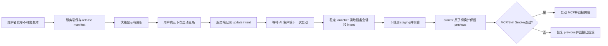
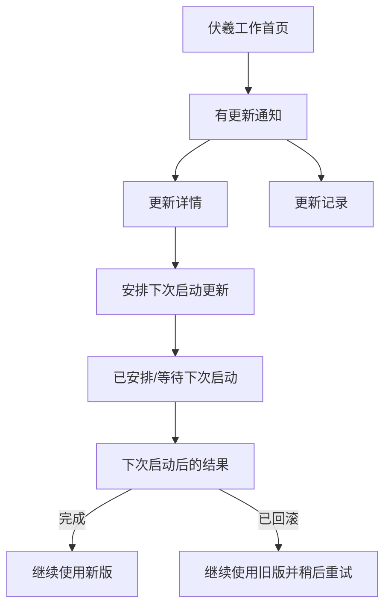
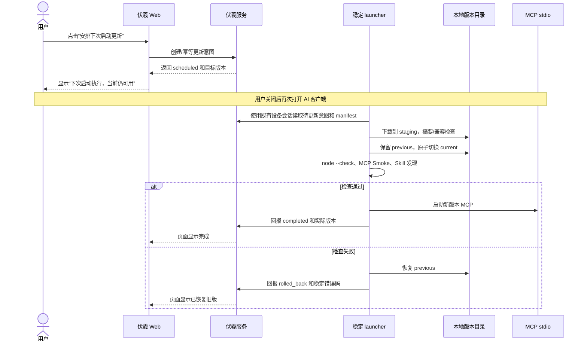
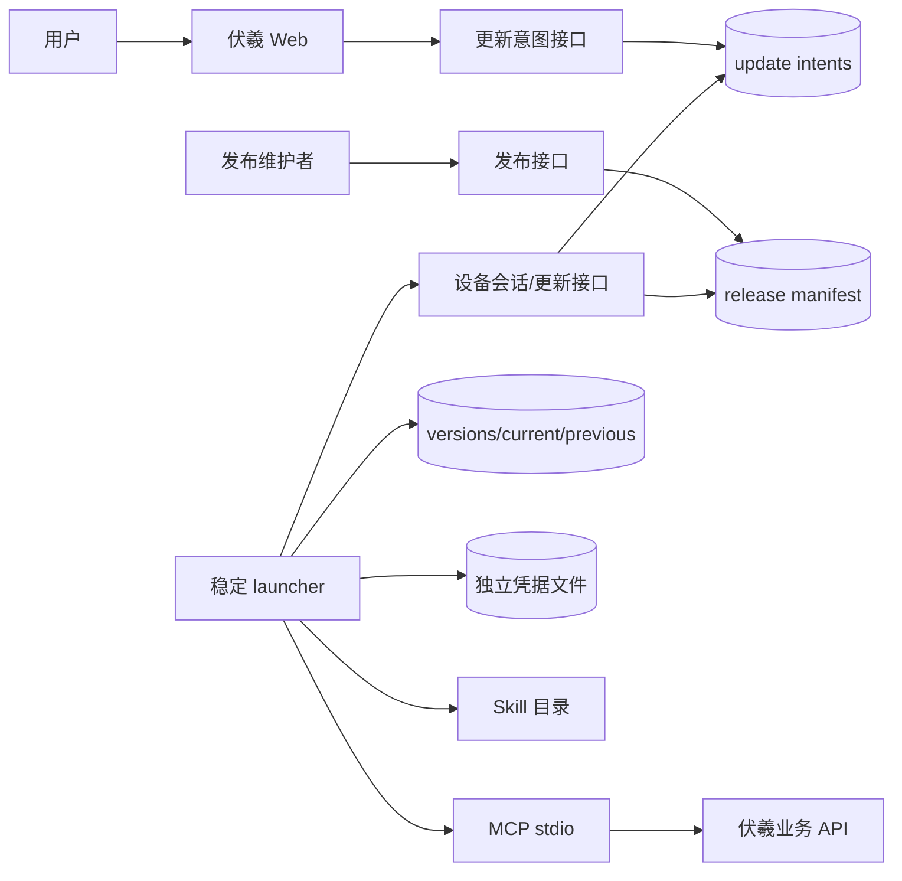
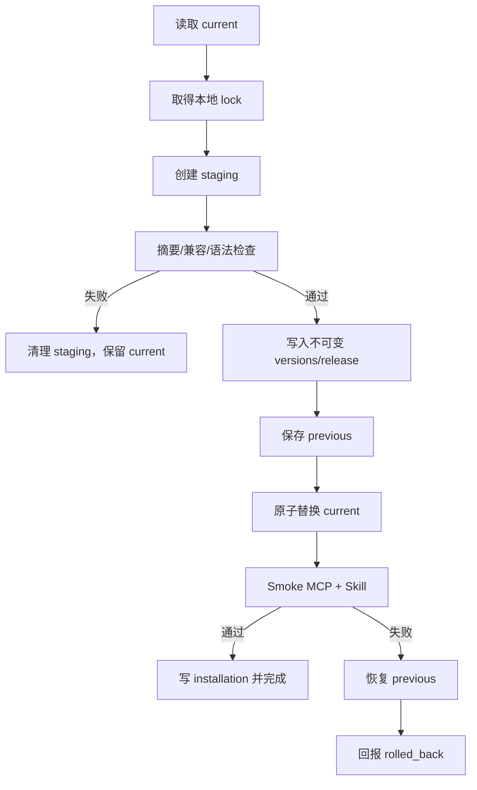
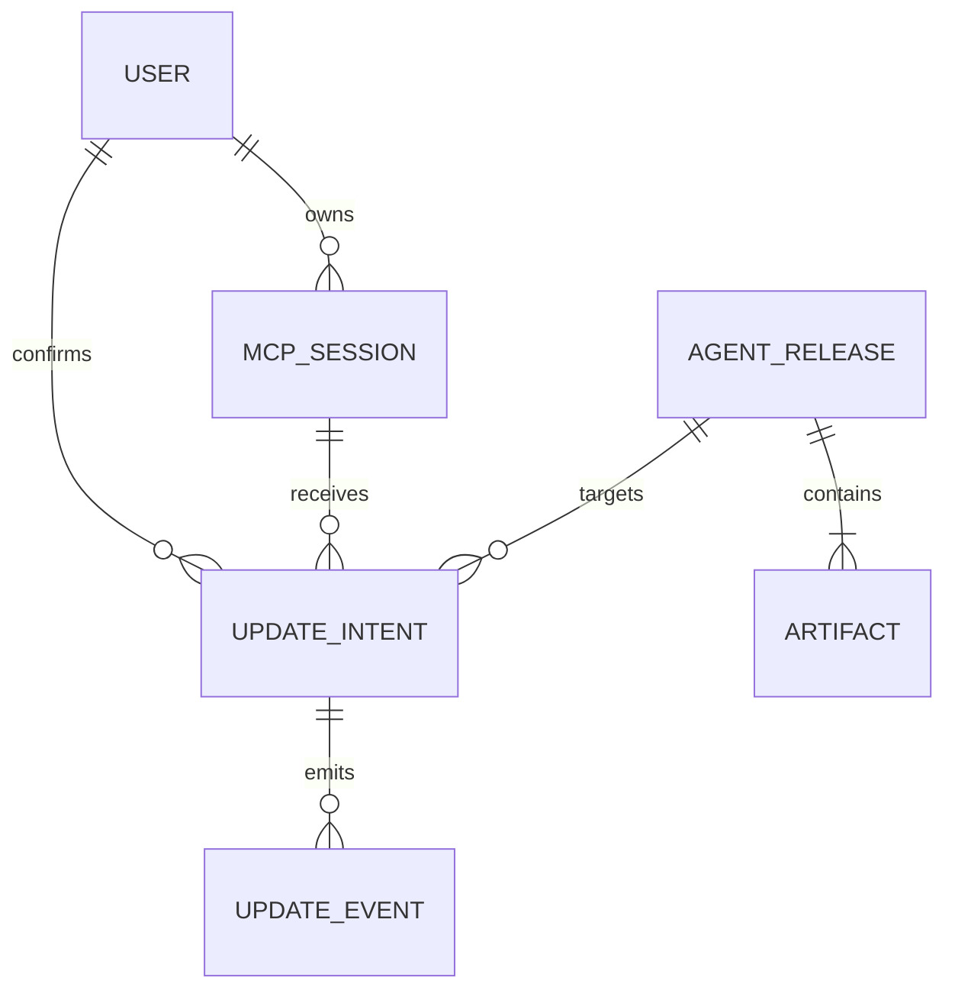
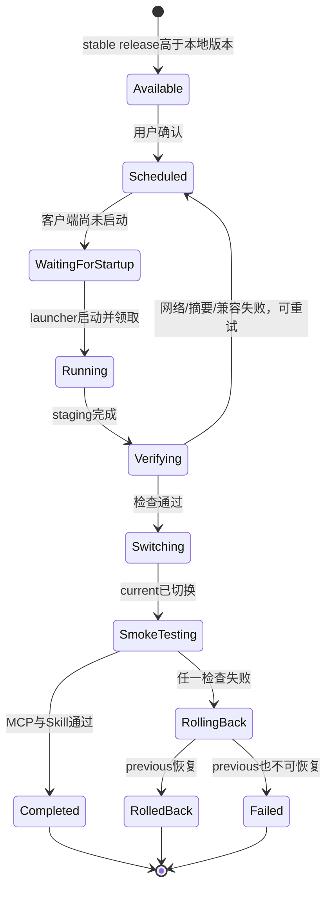

# 伏羲 MCP 与 Skill 延后更新全量详细设计

> 设计基线：2026-08-21
> 关联原型：[index.html](./index.html)
> 设计摘要：[DESIGN_SUMMARY.md](./DESIGN_SUMMARY.md)
> 状态：延后更新决策已确认；本地 Windows 技术试验完成；真实产品接入尚未开始

## 1. 文档地位

本文是“已接入用户如何在不重跑首次接入的前提下更新本地 MCP stdio 与 Skill”的当前权威设计。受众是产品负责人、平台后端、MCP/Skill 维护者和实现 Agent。

证据边界分为三层：当前仓库和运行约定是已验证事实；本文的延后更新规则是用户确认的产品决定；`mcp-server/tests/update-spike` 是隔离的本地技术证据，不能替代真实服务端、AI 客户端或 16077 验收。

原先的“立即更新、update ticket、`fuxi-agent://` 深链接、常驻更新服务”方案已 superseded。它们可以在未来重新评估，但不属于本设计的 MVP。

## 2. 第一性原理

### 2.1 不可约结果

已完成首次接入的用户看到伏羲有新版本后，只需确认一次；AI 客户端下一次启动时，MCP 与 Skill 自动完成安全更新，原有会话、凭据和业务项目不受影响。

### 2.2 无法绕开的事实

1. MCP stdio 和 Skill 文件位于用户本机；浏览器不能直接修改本地文件。
2. 当前 MCP 由 AI 客户端启动，客户端关闭时没有可执行的 MCP 进程。
3. Windows 正在运行的 Node 文件不能被当作可安全覆盖的普通文本；必须先 staging，再切换，再 Smoke。
4. refresh token 是既有设备会话的凭据，不能进入页面、下载 URL、日志或制品。
5. Skill 可能被 AI 客户端缓存；文件更新成功不等于当前会话已经加载新能力。

### 2.3 尚未验证的旧假设

- 浏览器点击后用户一定需要“立即看到本地文件变化”。当前目标只要求下次使用时可用。
- 需要自定义协议或常驻服务才能完成更新。若启动器能在 MCP 前执行，二者都不是 MVP 必需。
- 每次更新都需要新的短期票据。已有设备会话可在启动器内完成鉴权，是否需要更窄的下载授权属于后续安全评估。
- MCP 和 Skill 必须在用户关闭客户端的同一瞬间完成。实际可接受的结果是下次启动前完成。

## 3. 已确认决策

| ID | 决策 | 当前答案 | 影响 |
|---|---|---|---|
| D-01 | 核心结果 | 已接入用户无需重跑完整接入 | 更新流程与首次接入解耦 |
| D-02 | 执行时机 | 下一次 AI 客户端启动前 | 浏览器只记录意图，不能伪造本地执行 |
| D-03 | 用户确认 | 用户点击“安排下次启动更新” | 不做后台静默更新 |
| D-04 | 发布权威 | 服务端不可变 release manifest | 本地版本不能反向定义可用版本 |
| D-05 | 设备事实 | 本地 installation manifest + MCP 启动回报 | 页面以回读结果显示完成 |
| D-06 | 版本单元 | MCP/Skill 配套 release 一起切换 | 禁止半更新对外可见 |
| D-07 | 失败边界 | 摘要、语法、Smoke、权限或磁盘失败都回滚 | 旧版必须继续可用 |
| D-08 | 凭据边界 | 复用设备会话，凭据与版本目录分离 | 不新增连接码和页面 token |
| D-09 | 稳定入口 | AI 客户端最终配置指向版本无关的 launcher | 旧用户需要一次迁移，新用户从接入时安装 |
| D-10 | MVP | Windows + stable + 手动确认 + 下次启动 + 回滚 | 深链接、守护、多平台、灰度后置 |

## 4. MVP 范围

MVP 只证明一条端到端路径：发布兼容版本 → 伏羲通知 → 用户确认“下次启动更新” → 客户端下次启动 → launcher 消费意图 → 本地安全切换 → MCP/Skill Smoke 通过 → 伏羲显示完成；任何失败均回到旧版。

### 4.1 必须有

- `agent_releases` 或等价的不可变版本清单：MCP/Skill 版本、摘要、兼容 API、最低 Node.js、stable 渠道。
- `update_intents` 或等价的用户确认记录：用户、设备会话、目标 release、状态和时间。
- 版本无关的本地 launcher：启动前消费待更新，旧版不可用时保留 previous。
- 本地安装清单、`current`/`previous`、staging 目录、锁和结果状态。
- `node --check`、MCP `--smoke`/等价连接检查和 Skill 发现检查。
- 页面提示和结果状态与真实本地回报一致。

### 4.2 明确不做

- 不在浏览器中执行任意脚本，不注册 `fuxi-agent://`。
- 不要求客户端关闭时立即发生更新，不运行 Windows 常驻后台服务。
- 不新增日常连接码、update ticket 或第二套长期身份系统。
- 不在更新器内修改 AI 客户端的业务配置、项目文件、Node.js 安装和凭据文件。
- 不做多平台、灰度渠道、无人确认、自动重启和远程强制更新。

## 5. 用户、角色与权限

### 5.1 角色

- **发布维护者**：发布或撤回 stable release；不能读取用户设备凭据。
- **已接入用户**：查看自己设备的版本并确认下次启动更新。
- **稳定 launcher**：在本机执行固定更新流程；不接受页面下发的任意命令。
- **伏羲服务**：保存发布清单、设备会话、更新意图和结果投影。

| 操作 | 发布维护者 | 已接入用户 | launcher | 伏羲服务 |
|---|---:|---:|---:|---:|
| 发布 stable release | ✓ | — | — | 校验并保存 |
| 查看自己的更新 | — | ✓ | 通过会话 | ✓ |
| 确认下次启动更新 | — | ✓ | — | 记录意图 |
| 下载目标制品 | — | — | 既有会话 | 提供固定文件 |
| 替换本地版本 | — | — | ✓ | — |
| 回滚本地版本 | — | 选择稍后重试 | ✓ | 记录结果 |

### 5.2 权限不变量

更新意图绑定用户和设备会话；launcher 只能使用本机凭据、目标 release 和固定版本目录。用户没有权限把更新意图指向别人的设备；维护者没有权限通过发布接口执行用户本地命令。

## 6. 用户旅程与信息架构

用户只需要理解“有更新、何时执行、失败后怎么办”，实现机制默认隐藏。

### 6.1 页面状态

| 页面/状态 | 用户要知道什么 | 主操作 | 必须显示 |
|---|---|---|---|
| 有更新 | 更新现在不会发生 | 查看更新 | 当前/目标版本、执行时机 |
| 更新详情 | 更新什么、是否影响工作 | 安排下次启动更新 | MCP/Skill 变更、会话保留 |
| 已安排 | 平台已经记住选择 | 关闭提示或查看记录 | 下次启动执行、当前仍可用 |
| 等待启动 | 为什么还没有完成 | 等待重启客户端 | “客户端关闭后才会执行” |
| 完成 | 新版是否真的可用 | 继续使用 | MCP/Skill 实际版本、检查结果 |
| 已回滚 | 失败是否影响当前工作 | 稍后重试/继续旧版 | 旧版版本、稳定错误码 |

## 7. 核心交互与启动时序

浏览器点击只写服务端意图，不等待本地脚本，也不把“已安排”说成“已更新”。

### 7.1 用户提示规则

| 时点 | 固定文案 | 禁止文案 |
|---|---|---|
| 有更新 | 更新不会立即修改本地文件；下次打开 AI 客户端时自动更新 | 正在更新、立即完成 |
| 点击后 | 已安排下次启动更新；当前客户端继续可用 | 更新成功 |
| 客户端仍运行 | 更新会等到本次客户端退出后、下一次启动前执行 | 已在后台替换 |
| 完成 | MCP 与 Skill 检查通过，已使用新版本 | 下载成功 |
| 回滚 | 新版本检查未通过，已恢复上一版本，当前仍可继续使用 | 更新失败，无法使用 |

## 8. 目标系统架构

这张图的结论是：浏览器只产生确认意图，launcher 才拥有本地文件写权限；服务端、设备会话和本地版本目录各自保持单一所有权。

### 8.1 边界与所有权

| 组件 | 负责 | 不负责 | 权威数据 |
|---|---|---|---|
| 伏羲 Web | 通知、确认、结果展示 | 执行本地脚本、保存 refresh token | 服务端状态投影 |
| 发布接口 | 校验并发布不可变制品 | 操作用户设备 | release manifest |
| 更新意图接口 | 记录用户选择、幂等和权限 | 直接改本地文件 | update intent |
| launcher | 下载、校验、切换、回滚、启动 MCP | 接受任意命令、改业务目录 | installation manifest |
| MCP/Skill | 提供能力、上报版本 | 自行发布或覆盖凭据 | 本地运行事实 |

## 9. 核心对象生命周期

### 9.1 Release

维护者提交 MCP/Skill 配套制品，服务端校验目录边界、摘要、Node/API 兼容性和禁止文件后生成不可变 `releaseId`。发布后不原地修改；撤回只阻止新的更新意图，不删除已存在制品。

### 9.2 Update intent

用户确认后创建 `(userId, sessionId, releaseId)` 的待更新意图。重复点击返回同一活动意图。客户端尚未启动时意图保持 `scheduled`；launcher 领取后进入 `running`，成功为 `completed`，失败但旧版恢复为 `rolled_back`。

### 9.3 Local installation

本地 `installation.json` 记录当前 release 和路径；`current.json` 是启动入口读取的原子指针；`previous.json` 记录最近一次成功版本；凭据文件独立存放，不随版本切换移动。

## 10. 构建、检查与制品

发布前最小门禁：

| Gate | 通过条件 | 失败行为 |
|---|---|---|
| 包结构 | MCP 入口、Skill `SKILL.md` 存在；无 `.git`、凭据、`node_modules` | release 不可发布 |
| 摘要 | manifest 摘要与下载 bytes 一致 | 删除 staging，不切换 |
| 运行时 | Node.js 满足最低版本、API schema 兼容 | 保留旧版，标记不可更新 |
| MCP Smoke | `node --check`、启动检查和最小工具发现通过 | 恢复 previous |
| Skill 发现 | `SKILL.md`、名称和能力缓存可读 | 恢复 previous |
| 凭据隔离 | 版本包不包含凭据路径和内容 | 阻断发布 |

本地试验使用目录制品模拟下载；正式实现必须将相同校验应用于临时下载文件，不得因来源从本地变成 HTTP 而放宽门禁。

### 10.1 Manifest 与校验顺序

manifest 本身也要作为不可变输入校验：先确认 releaseId、channel、目标版本和 API schema，再按制品种类校验大小与 SHA-256，最后检查解压后的相对路径和入口文件。校验顺序不能先替换再补检查，因为 Windows 上半替换会把旧版的可恢复边界变成不确定状态。所有失败都只能发生在 staging；`current` 在最后一个检查通过前保持不变。

### 10.2 Smoke 最小集合

MCP Smoke 至少覆盖 Node 语法、进程可启动、`check_connection` 或等价连接检查和 `tools/list` 的稳定核心工具；Skill Smoke 至少覆盖 `SKILL.md` 可读、名称可发现和能力缓存版本一致。Smoke 只证明“组件可用”，不替代真实业务写入、原型上传或生产验收。

## 11. 版本、发布与回滚

### 11.1 版本身份

`releaseId` 不复用；`mcpVersion` 和 `skillVersion` 是配套版本；manifest 至少包含渠道、API schema、最低 Node.js、两个制品的 URL/大小/SHA-256 和发布时间。

### 11.2 本地切换

launcher 先把两个制品写入 `staging/<releaseId>-<runId>`，通过所有检查后复制到不可变 `versions/<releaseId>`，写入 `previous`，最后用同目录临时文件重命名更新 `current`。切换后再执行一次 Smoke，失败则把 `previous` 恢复为 `current`。

### 11.3 保留策略

至少保留 `current` 和 `previous`。清理由 launcher 在成功后进行，不能删除 current 指向的目录；清理失败不影响已完成更新。

## 12. 跨模块交互

首次接入负责安装 MCP、Skill、凭据和稳定 launcher；日常更新只使用已建立的设备会话。伏羲协作任务、原型版本、候选预览和任务码不参与组件更新状态，也不会被更新器改写。

兼容判断分三层：服务端 API schema、MCP/Skill 配套 release、本机 Node.js/操作系统。任一层不满足，页面显示“当前设备暂不支持此更新”，不删除旧版。

## 13. 数据模型

| 实体 | 身份 | 关键字段 | 约束 |
|---|---|---|---|
| `agent_releases` | `release_id` | channel、版本、兼容条件、状态 | 发布后摘要不可变 |
| `agent_artifacts` | release + kind | URL、size、sha256 | MCP/Skill 各一份 |
| `mcp_sessions` | 既有 session id | user、设备、过期、最近版本 | refresh token 只存哈希 |
| `update_intents` | intent id | session、release、status、requested_at | 同设备同 release 只保留一个活动意图 |
| `update_events` | event id | intent、stage、error_code、versions | append-only，不写 token |
| `installation.json` | 本地文件 | current release、路径、更新时间 | 不含 refresh token 内容 |

### 13.1 并发约束

服务端创建意图使用幂等条件；launcher 使用本地独占 lock。同一设备同时只有一个切换过程。结果回报允许重试，但终态不能被旧事件覆盖。

## 14. 接口设计

以下是正式接入的最小接口方向，当前尚未实现：

| 方法 | 输入 | 输出 | 语义 |
|---|---|---|---|
| `GET /api/integrations/updates` | 当前用户/设备 | 当前版本、可用 release、原因 | 页面只读 |
| `POST /api/integrations/update-intents` | session、release | intent、scheduled、expires | 用户确认，幂等 |
| `GET /api/integrations/update-intents/:id` | intent id | stage、结果、错误码 | 页面轮询回读 |
| `GET /api/integrations/agent-manifest` | 设备会话 | manifest 与制品地址 | launcher 读取 |
| `POST /api/integrations/update-intents/:id/progress` | stage、版本 | 接收结果 | launcher 上报阶段 |
| `POST /api/integrations/update-intents/:id/result` | completed/rolled_back | 权威终态 | launcher 上报结果 |

错误语义：`UPDATE_NOT_SCHEDULED`、`RELEASE_INCOMPATIBLE`、`ARTIFACT_DIGEST_MISMATCH`、`UPDATE_LOCKED`、`UPDATE_SMOKE_FAILED`、`SKILL_DISCOVERY_FAILED`。错误响应不包含完整路径、token 或源码。

## 15. 状态机

这张图的结论是：用户确认后的主要等待状态是 `Scheduled/WaitingForStartup`，不是失败；只有 launcher 实际开始处理后，才进入校验、切换和回滚分支。

### 15.1 状态文案

| 内部状态 | 用户文案 | 允许动作 |
|---|---|---|
| `available` | 有更新 | 查看详情 |
| `scheduled` | 已安排下次启动更新 | 取消/查看记录（取消是否做由后续决策决定） |
| `waiting_for_startup` | 等待下次打开 AI 客户端 | 继续使用当前版本 |
| `running` | 正在启动前检查 | 等待 |
| `completed` | 更新完成 | 继续使用 |
| `rolled_back` | 已恢复旧版 | 查看原因、稍后重试 |
| `failed` | 更新未完成，需要处理 | 查看稳定错误码、人工介入 |

## 16. 系统不变量

1. 浏览器永远不能直接执行服务器下发的任意脚本。
2. 用户点击确认后，当前运行中的 AI 客户端和本地 MCP 不被强杀。
3. 没有稳定 launcher 时，页面不能声称“下次自动更新”；只能提示一次性迁移。
4. MCP 与 Skill 必须以兼容 release 一起对外可见。
5. 更新失败时 current 或 previous 至少有一个可启动版本；没有 previous 时不得删除 current。
6. 凭据、业务项目和 AI 客户端配置不属于版本目录，更新器不得覆盖。
7. 只有 launcher 的本地结果和服务端回读都完成，页面才能显示“更新完成”。
8. 意图、发布清单和审计事件不能被用户制品内容改写。

## 17. 安全与信任边界

### 17.1 身份

更新意图使用已登录用户和已建立设备会话。launcher 通过本地凭据完成现有 access/refresh 流程；页面永远看不到 refresh token。若会话已撤销，launcher 不下载、不切换，页面提示重新接入。

### 17.2 制品和路径

服务端发布固定 artifact，不接受“执行命令”。launcher 验证 HTTPS/网络响应、长度、SHA-256、ZIP 条目路径和 release 绑定；拒绝绝对路径、`..`、`.git`、`node_modules`、凭据文件和业务项目路径。所有写入都限制在自身 versions/staging 目录。

### 17.3 日志

只记录 release、intent、stage、稳定 error code 和耗时；不记录 token、完整下载查询串、用户完整目录、源码和命令行敏感参数。

## 18. 一致性与故障恢复

### 18.1 断网/客户端关闭

断网发生在客户端启动时，保留 `scheduled` 意图和旧版，下一次启动重试；不因一次网络失败删除旧版。用户仍可使用当前 MCP，页面显示“等待重试”。

### 18.2 正在运行

用户点击后不触碰当前进程。launcher 只会在 AI 客户端启动边界执行；若检测到旧进程锁，返回 `WAITING_FOR_CLIENT_EXIT`，待下一次启动再消费。

### 18.3 失败后对账

服务端以结果事件记录业务状态，以 launcher 上报的 installation manifest 作为设备事实。两者冲突时显示“需要重新检查”，不把浏览器上的 scheduled 当作 completed。

### 18.4 回滚失败

若 previous 恢复也失败，保留 current、previous、staging 和错误事件，不自动删除文件；页面给出稳定错误码和人工恢复入口。这是需要真实 Windows 验证的最高风险路径。

## 19. 现状迁移

### 19.1 当前差异

现有系统已有首次接入提示词、MCP ZIP/Skill ZIP、设备会话、refresh token 轮换和 `FUXI_CREDENTIALS_FILE`。现有提示词仍把 MCP stdio 指向 `src/server.js`，因此还没有稳定 launcher、发布清单、更新意图或启动前消费路径。

### 19.2 一次性迁移

1. 先实现稳定 launcher，并让它能在无待更新时完全等价地启动当前 MCP。
2. 新用户接入时把 AI 客户端 stdio 配置写为 launcher；凭据文件路径保持不变。
3. 旧用户通过一次受控的组件刷新把配置从 `server.js` 改为 launcher；这次刷新是迁移，不是日常更新，必须明确告知。
4. 16077 先用独立测试设备验证“无待更新启动不回归”和“下次启动更新”；16088 只接收同一不可变 release 的完整门禁结果。

迁移失败时，保留原有 `server.js` 配置和旧版 MCP；不能把 launcher 安装失败误报为日常更新成功。

## 20. 可观测性与运维

| 事件 | 目的 | 关键字段 | 行动 |
|---|---|---|---|
| `release.published` | stable 版本进入渠道 | release/channel | 发布失败阻断通知 |
| `update.scheduled` | 用户确认意图 | user/session/release | 统计确认率 |
| `update.started` | launcher 消费意图 | intent/stage | 定位启动失败 |
| `update.verification_failed` | 摘要或兼容问题 | release/error code | 阻断切换并重试 |
| `update.completed` | 版本覆盖率 | old/new/platform | 观察成功率 |
| `update.rolled_back` | 新版运行风险 | release/error code | 暂停或撤回 release |

服务端保留 release 和审计；本地只保留 current、previous、installation 和最近结果，清理由成功后的 launcher 执行。

## 21. 性能与体验目标

| 指标 | MVP 目标 | 说明 |
|---|---:|---|
| 页面发现更新 | 登录页面 60 秒内 | 轮询延迟不影响本地安全 |
| 确认反馈 | P95 < 2 秒 | 只确认服务端已记录意图 |
| 启动前本地检查 | 100 MB 制品 P95 < 10 秒（不含下载） | 超时保留旧版 |
| 切换与 Smoke | P95 < 8 秒 | 不含网络下载和 AI 客户端自身加载 |
| 结果回读 | launcher 回报后 1 秒内可见 | 页面不得提前显示完成 |

## 22. 验收设计

### 场景 A：正常延后更新

Given 用户设备当前为 v1，When 用户在伏羲确认下次启动更新且关闭后再次启动 AI 客户端，Then launcher 读取意图、切换到 v2，MCP/Skill 检查通过，页面显示完成，凭据内容不变。

### 场景 B：客户端尚未关闭

Given AI 客户端仍在运行，When 用户点击确认，Then 页面显示已安排，当前会话不被打断；下一次启动前才执行更新。

### 场景 C：摘要或 Smoke 失败

Given v2 摘要不匹配或 Smoke 失败，When launcher 处理意图，Then 不显示完成，current 恢复 v1，页面显示已恢复旧版。

### 场景 D：重复确认和并发启动

Given 用户连续确认或两个 launcher 同时启动，When 服务端和本地锁处理请求，Then 只保留一个活动意图和一个切换过程，第二个调用得到幂等/锁定结果。

### 场景 E：会话失效

Given 设备会话已撤销，When launcher 启动，Then 不下载、不切换，旧 MCP 仍可保留，页面提示重新接入而不是重新生成普通任务码。

### 场景 F：真实环境边界

在 Windows 真实设备完成一次迁移、服务端发布、页面确认、AI 客户端重启、MCP tools/list、Skill 发现、凭据保留和回滚；记录 16077 健康、intent 回读和本地文件指针。静态原型与本地 spike 不能替代这一场景。

## 23. 实施拆解

### 阶段 0：本地机制试验（已完成）

用两个本地 fixture 验证启动前消费、摘要/Smoke 回滚、凭据隔离、运行中等待和并发锁。退出条件是 `npm run test:update-spike` 通过并输出结构化证据。

### 阶段 1：稳定 launcher（未开始）

实现无待更新时的等价启动、installation manifest、current/previous、lock 和启动前结果回报。退出条件是旧版业务工具与 launcher 启动行为一致。

### 阶段 2：服务端发布与意图（未开始）

增加 release manifest、update intent、幂等回读和版本上报；不增加深链接和后台服务。退出条件是 API 能记录意图并被设备会话读取。

### 阶段 3：真实 MCP/Skill 制品切换（未开始）

把本地试验的校验、切换、Smoke 和回滚接入真实包，先保护凭据和用户配置。退出条件是隔离测试设备完成 v1→v2 和失败恢复。

### 阶段 4：伏羲提示与 16077 人工验收（未开始）

实现通知、详情、已安排、等待启动、完成和回滚文案；用户人工关闭/重启 AI 客户端验证。退出条件是完整回读证据，而非页面截图 alone。

## 24. 实施顺序约束

1. 先实现 launcher 无待更新等价启动，再开放平台确认；否则新用户会因入口变化无法启动 MCP。
2. 先实现本地 staging、lock、current/previous、Smoke 和回滚，再接真实下载。
3. 先接 update intent 和回读，再做“有更新”通知；浏览器不能先做一个没有权威状态的更新按钮。
4. 先保护凭据、业务目录和用户配置边界，再允许替换 MCP/Skill 文件。
5. 先在 16077 用独立 Windows 设备人工验收，再考虑 16088 完整门禁；轻量测试不等于生产证明。

禁止以“已安排”代替“已完成”，禁止以“下载成功”代替 Smoke 通过，禁止在当前 MCP 运行时强杀进程，禁止把旧用户未迁移误报为自动更新可用。

## 25. 完成定义

### 产品与交互

- 用户清楚知道更新不会立即发生、何时发生、失败后能否继续工作。
- 页面状态只来自服务端意图和 launcher 回报，不根据按钮点击伪造完成。

### 本地技术

- 稳定 launcher 在 Windows 上可靠启动旧版和新版 MCP。
- MCP/Skill 兼容 release 可原子切换，摘要、语法、Smoke、Skill 发现失败自动恢复。
- refresh token、凭据文件、业务项目和 AI 客户端配置不被覆盖。

### 平台与验证

- release、intent、设备版本和结果事件具备权限、幂等和稳定错误语义。
- `npm run test:update-spike` 通过；随后完成真实 Windows 迁移和 16077 人工回读。
- 在真实环境证据形成前，只能称为“设计完成/本地试验通过”，不能称为主动更新已上线。
