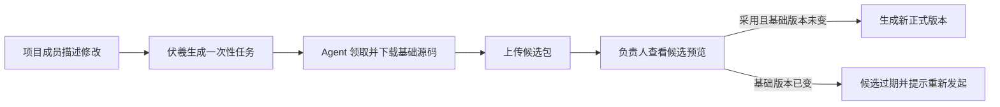
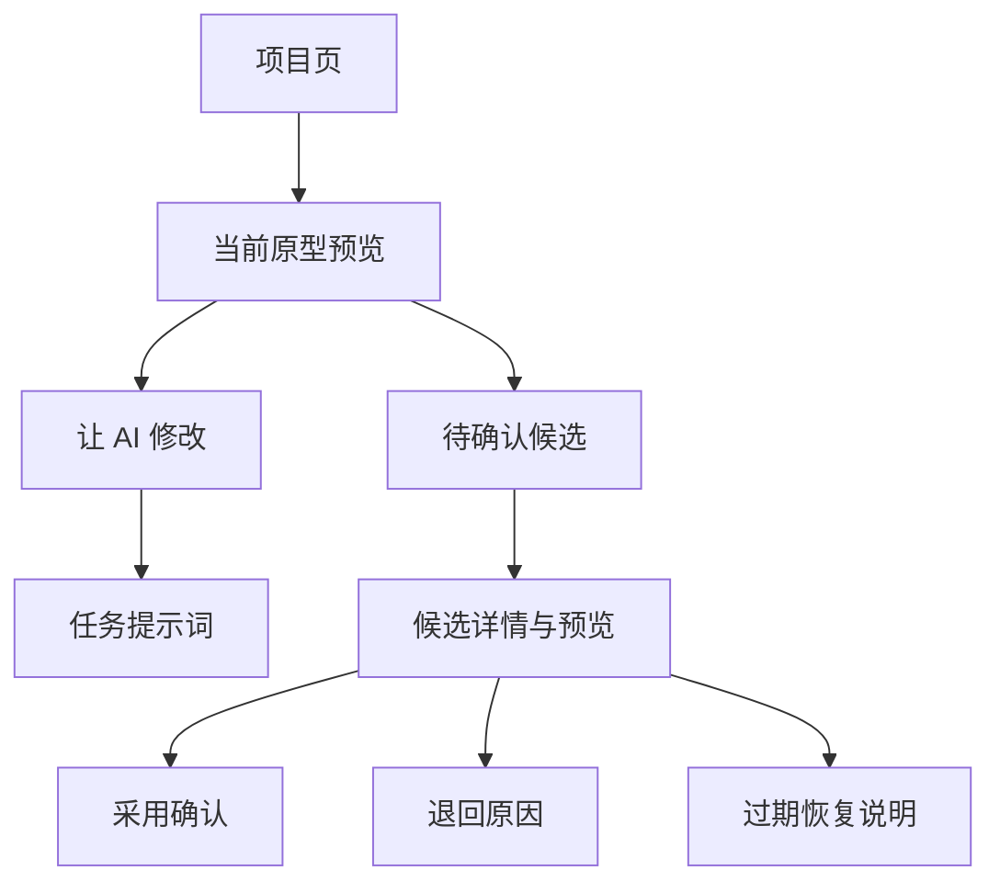
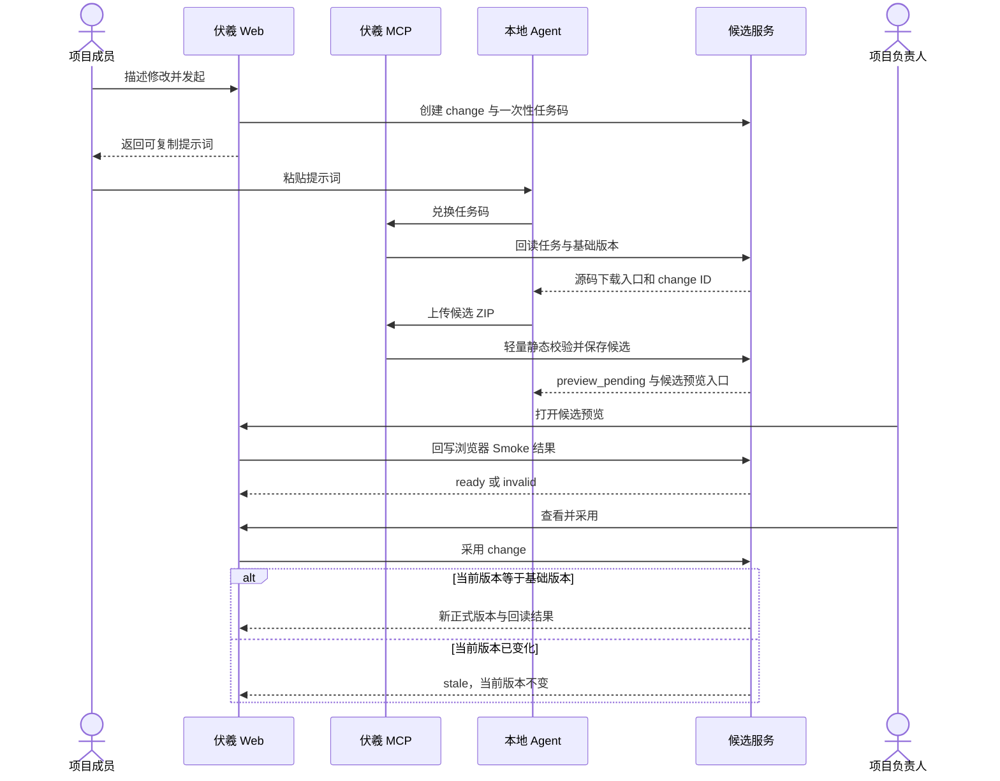
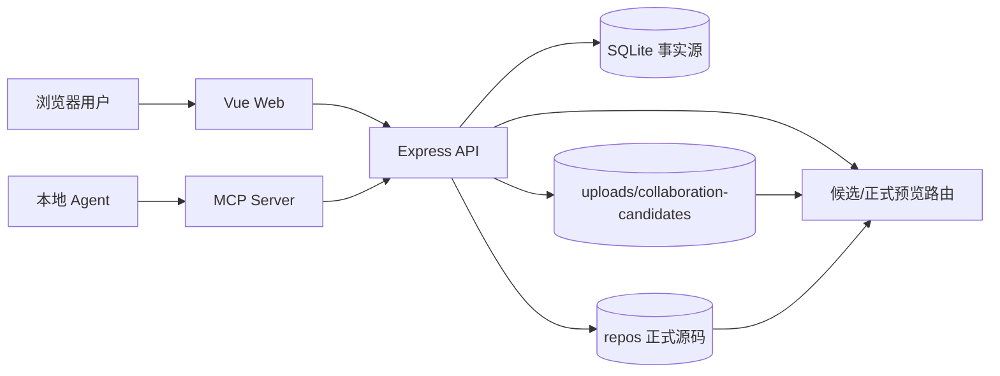
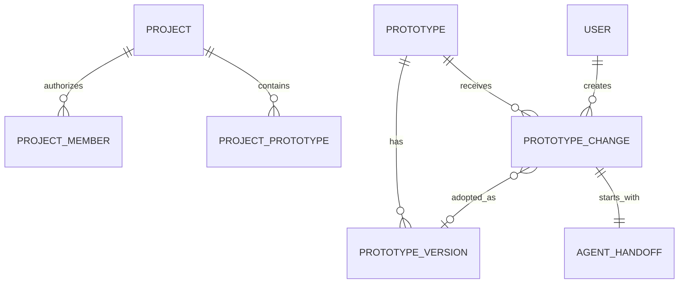
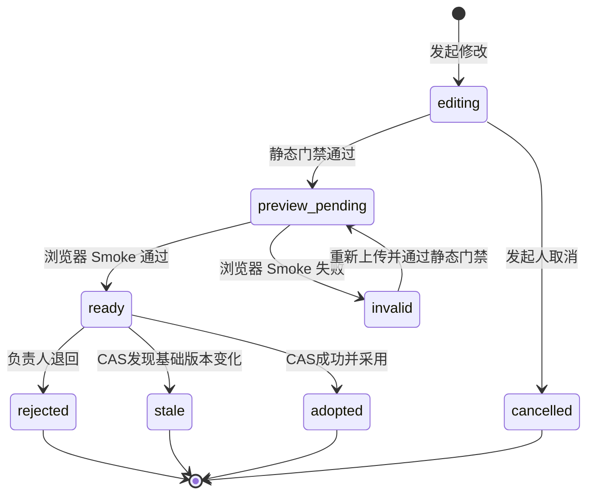

# 伏羲轻协作 MVP 全量设计

## 1. 文档地位

本文是无 Git 多人协作纵向切片的实现契约，服务于产品、前后端、MCP、测试与运维。当前代码和运行证据优先于历史 Git 协作设计；旧方案保留为被替代记录，不再约束本 MVP。本文区分已确认决定、现有事实、实现目标和验收证据。本地测试只能证明代码路径，`16077` 真实登录、上传、预览与采用才证明测试环境可用。

## 2. 第一性原理

多人协作不可约的结果不是“多人拥有仓库”，而是“多人提出修改，唯一负责人可以看见影响并决定哪个结果成为正式版本”。为保护该结果，只保留三条原则：当前正式版本必须有唯一事实源；任何候选不得静默覆盖更新后的基线；采用是明确的人类决定。代码托管、分支和自动合并不是达到结果的必要条件。

## 3. 已确认决策

| ID | 决定 | 状态 | 结果 |
|---|---|---|---|
| D-01 | 主结果 | confirmed | 成员提交 AI 候选，负责人预览并采用 |
| D-02 | 事实源 | confirmed | SQLite 元数据与平台持久化文件 |
| D-03 | 权限 | confirmed | 成员发起；Owner/Admin 审核 |
| D-04 | 交接 | confirmed | 一次性任务码 + 已登录 MCP 会话 |
| D-05 | 冲突 | confirmed | 基础版本 CAS；变化则过期 |
| D-06 | 正式化 | confirmed | 上传只生成候选，采用才生成正式版本 |
| D-07 | 自动合并 | confirmed | MVP 不做 |
| D-08 | Git 方案 | superseded | 不再作为 MVP 前置依赖 |

## 4. MVP 范围

最小闭环从项目成员描述一次修改开始，以负责人采用后产生可回读的新正式版本结束。

- MVP 必须覆盖正常闭环、退回和过期保护。
- 不做源码自动合并、浏览器编辑和实时共同编辑。
- 不扩展项目发布 manifest；沿用现有项目快照能力。
- 最高成本失败是旧候选覆盖新版本，因此 CAS 是退出门禁。

## 5. 用户、角色与权限

| 角色 | 查看项目 | 发起修改 | 领取本人任务 | 上传候选 | 采用/退回 |
|---|---:|---:|---:|---:|---:|
| Owner/Admin | 是 | 是 | 是 | 是 | 是 |
| Editor | 是 | 是 | 是 | 是 | 否 |
| Viewer | 是 | 否 | 否 | 否 | 否 |
| Agent | 继承用户 | 仅任务范围 | 一次 | 仅对应 change | 否 |

项目成员关系是业务权限唯一边界。一次性任务码不是长期凭据，只定位用户已经授权的任务；MCP 仍需有效用户会话。采用与退回是不可逆业务决定，必须重新按当前项目角色鉴权。

## 6. 用户旅程与信息架构

默认入口仍是项目页，协作能力围绕当前选中的原型渐进披露。

- Editor 默认看到“让 AI 修改”，看不到采用操作。
- Owner/Admin 在有 `ready` 候选时看到“待确认”入口。
- 技术字段只在诊断摘要中出现，不进入默认视觉层级。
- 候选详情同时显示目标、发起人、基础版本和候选预览。

## 7. 核心交互设计

候选上传必须先成为独立可预览状态，不能直接改变当前原型。

发起弹窗只有“生成任务”主按钮。成功后展示短提示词和复制按钮；复制失败必须允许手工选择。候选详情以预览为主，采用按钮需要二次确认，退回要求原因。`stale` 页面只给“基于最新版重新发起”的恢复动作。

## 8. 目标系统架构

伏羲拥有全部持久状态；本地 Agent 是不可信执行边界，只能提交候选，不能改变正式版本。

- DB 拥有任务、change、状态、基础版本和审核记录。
- `repos` 拥有当前正式源码及不可变历史目录。
- `uploads/collaboration-candidates` 拥有未采用候选，发布时作为共享持久目录保留。
- 外部代码托管不参与闭环，也不持有业务权限。

## 9. 核心对象生命周期

`change` 在发起时绑定 `project_id`、`prototype_id`、`created_by` 与 `base_version_number`。任务码只返回一次，服务端仅保存 hash。兑换后 change 仍处于 `editing`；候选 ZIP 通过轻量静态校验后进入 `preview_pending`，负责人打开预览并通过浏览器 Smoke 后才进入 `ready`。Smoke 失败进入 `invalid`，可由 Agent 重新上传；负责人采用后进入 `adopted`；退回进入 `rejected`；版本变化导致采用失败时进入 `stale`。

候选文件目录以不可猜测 change ID 命名。候选生成后禁止原地覆盖；同一 change 的重复提交返回状态冲突。需要再次修改时创建新 change，保留前一条审计链。

## 10. 构建、检查与制品

MVP 接受已构建的 Fuxi ZIP，复用现有 ZIP 大小、禁止文件、入口文件和路径校验。候选上传只执行快速静态门禁，不运行 npm 安装、完整构建或服务端浏览器自动化。候选门禁至少包括：ZIP 可解析；不存在路径穿越；入口文件可找到；文件总量和大小受限；入口引用的本地脚本/样式/静态资源存在；候选摘要与上传 bytes 绑定；候选预览只从独立目录读取。

| 制品 | 产生者 | 必须字段 | 可信条件 |
|---|---|---|---|
| 基础源码 ZIP | 伏羲 | prototype、version | 从当前正式目录即时生成 |
| 候选 ZIP | Agent | change、baseVersion | 校验通过且 digest 已记录 |
| 候选预览 | 伏羲 | change、entryFile | 只读候选目录 |
| 正式版本 | 伏羲 | version、digest、entryFile | CAS 成功且文件切换回读成功 |

候选校验不能只检查 ZIP 能否解压。服务端必须逐条检查规范化后的条目路径，拒绝绝对路径、盘符、`..` 跳转、符号链接和超出根目录的目标；限制解压后的文件数、单文件大小和总大小，避免压缩炸弹。入口识别沿用 `dist/index.html`、`build/index.html`、`index.html`、`public/index.html` 的确定性顺序，记录最终入口而不是相信客户端声明。上传临时文件无论成功或失败都必须删除，只有完整校验后的目录才能原子重命名到候选根目录。

候选预览先由浏览器 Smoke 检查资源加载、运行时错误和空白页面，再进入 `ready`；这只说明包能在伏羲预览环境打开，不代表业务逻辑正确。平台不在 MVP 内运行任意 npm 安装或构建命令，也不在服务端维护浏览器运行时，避免把服务器变成不可信代码执行器；Agent 必须在本地完成构建并上传静态产物。审核人以预览和修改目标判断是否采用，技术校验结果作为辅助说明。未来引入隔离 Build Worker 时也必须保持同一候选/采用状态机，不能让构建成功自动采用。

## 11. 版本、发布与回滚

基础版本使用 `prototype_versions` 的最大 `version_number`；不存在历史记录时为 0。采用成功创建 `base + 1` 的正式版本，并将候选复制为当前源码及对应历史目录。版本记录保存 `source_kind=collaboration_candidate` 与 `artifact_digest`。

文件切换使用 staging 与 backup：先完整准备新目录，保留历史版本，再交换当前目录；DB 写失败时恢复旧目录。现有版本回滚继续可用，但不改变已经终结的 change 审计记录。

## 12. 跨模块交互

Web 负责发起和审核，MCP 负责 Agent 领取与提交，后端统一执行权限、状态和 CAS。现有 prototype 下载接口提供基础源码；现有 preview 机制扩展候选命名空间。项目快照不自动吸收候选，只观察正式版本。

## 13. 数据模型

正式版本与候选版本必须是两个不同对象，change 连接业务目标、基础版本和候选文件。

| 对象 | 关键字段 | 不变量 |
|---|---|---|
| agent_handoffs | code_hash、expires_at、redeemed_at | 明文码不持久化；只能兑换一次 |
| prototype_changes | base_version_number、status、candidate_path、digest | 一个 change 只产生一个候选 |
| prototype_versions | version_number、entry_file、artifact_digest | 同一原型版本号单调递增 |
| audit_events | actor、action、resource、result | 不记录源码、码或凭据 |

迁移为增量、幂等迁移，不删除旧 Git 字段和表，以便现有数据可启动；新轻协作路径不读 Git 配置。

## 14. 接口设计

| 方法 | 路径/工具 | 权限 | 结果 |
|---|---|---|---|
| POST | `/api/projects/:id/prototypes/:prototypeId/changes` | editor+ | change、一次性提示词 |
| POST | `/api/projects/handoffs/redeem` | 发起用户 | change context |
| GET | `/api/projects/:id/changes` | 项目成员 | 候选列表 |
| GET | `/api/projects/:id/changes/:changeId` | 项目成员 | 候选详情 |
| POST | `/api/projects/:id/changes/:changeId/candidate` | 发起用户 | preview_pending 候选 |
| POST | `/api/projects/:id/changes/:changeId/preview-validation` | editor+ | ready 或 invalid |
| POST | `/api/projects/:id/changes/:changeId/adopt` | owner/admin | 新正式版本 |
| POST | `/api/projects/:id/changes/:changeId/reject` | owner/admin | rejected |

MCP 提供 `create_change_handoff`、`redeem_change_handoff`、`get_change_status` 和 `submit_change_candidate`。错误码固定包含 `HANDOFF_ALREADY_REDEEMED`、`HANDOFF_EXPIRED`、`CHANGE_NOT_EDITABLE`、`CANDIDATE_INVALID`、`STALE_BASE_VERSION`、`CHANGE_ALREADY_FINAL`。

## 15. 状态机

change 只能沿受保护的有限状态转换，任何终态都不能再次采用。

- `editing` 或 `invalid` 才允许重新上传候选。
- `ready` 之外禁止采用或退回；`preview_pending` 和 `invalid` 都不能进入采纳。
- CAS 失败必须同时保持当前文件不变并写入 `stale`。
- 重试采用已 adopted 的 change 返回原结果或明确终态，不再生成版本。

## 16. 系统不变量

1. 上传候选绝不改变当前正式预览。
2. 只有 Owner/Admin 的显式采用可以生成正式版本。
3. 采用时当前版本必须等于 change 基础版本。
4. 一次性任务码明文只返回一次且不可重复兑换。
5. Agent 权限不超过发起用户和项目成员权限交集。
6. 候选目录不能通过路径穿越访问其他文件。
7. DB 或文件切换失败时当前正式版本仍可用。
8. 审计中不得出现任务码、token、源码或完整 ZIP 内容。

## 17. 安全与信任边界

浏览器和 MCP 均使用现有短期 access token/可轮换设备会话。任务码至少 128 bit 随机值、十分钟有效、服务端保存 SHA-256 hash。上传 ZIP 是不可信输入，解压前检查条目路径，解压后以解析出的真实目录为边界。候选静态资源可由随机 change ID 定位，但 HTML 入口必须鉴权并检查项目访问权。

任务码的使用者还必须是任务发起用户本人，管理员不能仅凭任务码冒领普通成员的上下文。兑换成功只返回项目、原型、修改目标、基础版本、下载入口和允许的后续动作，不返回成员列表、平台 token、服务器目录或其他候选。候选提交接口同时校验 change 所属用户、项目成员资格和 `editing`/`invalid` 状态，任一条件变化都拒绝写入。浏览器 Smoke 回写沿用项目成员的提交权限，且只改变 `preview_pending` 状态；成员被移除后，尚未提交的任务立即失去提交权；已经 `ready` 的候选仍可由项目负责人审核，以避免孤儿记录。

HTML 候选入口通过现有预览 token/cookie 机制鉴权，静态资源路径位于高熵 change ID 下。即使资源 URL 被转发，敏感业务数据也不应写入静态包；平台继续把原型内容视为项目成员可见制品。所有服务端错误对外只返回稳定错误码和恢复建议，文件路径、堆栈、ZIP 条目原文和摘要计算细节只进入受控日志。

## 18. 一致性与故障恢复

sql.js 写入继续走单一串行入口。创建任务、兑换和状态迁移使用事务；文件与 DB 采用补偿式一致性。上传中断删除 staging，不改变 change；采用中断保留 backup 并恢复 current；服务重启后可根据状态与目录存在性巡检。重复请求按状态 fail closed，不猜测成功。

| 故障 | 用户看到 | 系统动作 | 恢复 |
|---|---|---|---|
| 任务码过期 | 任务已失效 | 不创建会话 | 重新发起 |
| ZIP 无入口 | 候选不可预览 | 删除 staging | 修复后新建 change |
| 基线变化 | 候选已过期 | 当前版本不变 | 基于最新版重做 |
| 采用文件切换失败 | 采用失败 | 自动恢复 backup | 负责人重试或运维介入 |

采用过程划分为 `prepare → compare → switch → persist → readback`。`prepare` 在正式目录之外构造完整 staging；`compare` 在进入串行写队列后重新读取当前版本；`switch` 先把 current 改名为 backup，再把 staging 改名为 current；`persist` 同一事务写版本、change 和原型入口；`readback` 从 DB 和文件系统重新读取版本、入口与 digest。任一步失败都不能返回成功。若失败发生在 switch 之后，补偿逻辑先移走失败 current，再恢复 backup；补偿也失败时记录高优先级告警并保持 change 为 ready，禁止第二次盲目采用。

服务启动巡检只做分类，不自动删除：DB 为 `ready` 但候选目录缺失标记运维异常；DB 为 `editing` 且已过期可显示“任务已失效”；终态 change 的候选目录按保留期列入清理清单；存在 adoption backup 时核对当前版本和 change 终态。任何自动清理都必须在后续阶段提供 dry-run、目录白名单和审计，本 MVP 不实现后台删除任务。

## 19. 现状迁移

旧项目默认 `legacy_checkout`，上线后可直接展示轻协作入口，不要求迁移到代码仓库。已有 `prototype_changes` 表增量增加候选字段，历史 Git change 保留但不会出现在轻协作默认列表。旧签出/签入接口继续兼容；新流程不依赖签出锁。回滚只需切回前一 release，新增表字段和候选目录可保留，不影响旧代码读取。

## 20. 可观测性与运维

记录 `change.created`、`handoff.redeemed`、`candidate.preview_pending`、`candidate.validation_failed`、`candidate.preview_passed`、`candidate.preview_failed`、`change.adopted`、`change.rejected`、`change.stale`。指标至少包含各状态数量、静态门禁失败率、浏览器 Smoke 失败率、从 ready 到审核耗时、CAS 过期率和文件补偿失败数。过期未提交任务和长期终态候选可由后续清理任务回收；MVP 先保留以便测试审计。

## 21. 性能与体验目标

| 目标 | 指标 |
|---|---:|
| 发起任务响应 | P95 < 1 s |
| 任务兑换响应 | P95 < 1 s |
| 100 MB 内候选静态门禁 | P95 < 10 s |
| 候选打开后浏览器 Smoke | < 3 s，不含 ZIP 上传 |
| 采用元数据与目录切换 | P95 < 3 s |
| 状态回读一致 | 写成功后立即可见 |

## 22. 验收设计

### 场景 A：正常闭环

Given Editor 发起修改，When Agent 兑换任务并上传有效候选、Owner 采用，Then 当前版本加一、预览显示候选内容、change 为 adopted。

### 场景 B：旧基线保护

Given 两个 change 基于版本 N，When 第一个被采用后再采用第二个，Then 第二个为 stale，版本保持 N+1，文件不变化。

### 场景 C：权限

Given Viewer 或普通 Editor，When 尝试采用候选，Then 返回 403，状态和文件不变。

### 场景 D：任务码重放

Given 任务码已经兑换，When 再次兑换，Then 返回 `HANDOFF_ALREADY_REDEEMED`，不泄露上下文。

### 场景 E：候选无效

Given ZIP 无入口或包含越界路径，When 上传，Then 返回 `CANDIDATE_INVALID`，当前版本不变且 change 保持 `editing`；Given 入口引用缺失资源或预览运行时报错，When 上传后打开候选，Then change 进入 `invalid`，不能采纳且允许重新上传。

### 场景 F：浏览器 Smoke

Given 候选通过静态门禁，When 项目成员打开候选预览，Then 页面回写 Smoke 结果；通过进入 `ready`，失败进入 `invalid`，负责人不能采用失败候选。

### 场景 G：真实环境

在 `16077` 使用两个真实伏羲用户和独立 MCP 会话，完成发起、兑换、下载、上传、候选预览、采用、退回与双候选过期；验证旧原型元数据零漂移。该证据不得由 mock 替代。

真实验收使用全新命名的测试项目、全新原型或明确属于验收用户的测试原型，不拿生产同步来的既有原型做候选采用。写入前记录测试环境原型 ID、版本、项目绑定和候选目录基线；写入后只允许出现约定的新版本和 change。验收至少保留 API 回读、预览 HTTP 状态、页面关键状态截图或 DOM 证据、MCP 工具结构化结果和数据库只读统计。若浏览器、MCP 或 API 任一链路只能由 mock 证明，则阶段保持未完成。

退回验收必须证明当前版本号、入口文件和文件摘要均未变化；过期验收必须证明第二个候选仍可预览但采用被拒绝；权限验收使用真实 Editor 调用采用接口并得到 403；重放验收重复兑换同一码并得到稳定错误；故障恢复至少上传一个无入口 ZIP，确认临时目录清理且 change 仍可解释。完成后不删除证据记录，只清理由本次测试创建的临时上传文件。

## 23. 实施拆解

### 阶段 1：数据与服务

增加轻协作字段、候选存储、任务兑换、状态服务和 CAS 采用。退出条件：服务测试证明正常采用、权限、重放和 stale。

### 阶段 2：MCP 纵向切片

增加四个 Agent 工具并复用 ZIP 校验。退出条件：独立 MCP 测试能领取、上传并回读 `preview_pending`；浏览器 Smoke 通过后回读 `ready`。

### 阶段 3：Web 审核体验

增加发起弹窗、任务提示词、候选列表/预览和采用/退回。退出条件：前端 build 与交互原型一致。

### 阶段 4：16077 验收

构建同一不可变候选并部署测试环境，执行真实用户闭环。退出条件：API、页面、MCP、文件和 DB 均可回读，旧数据无漂移。

## 24. 实施顺序约束

不得先做视觉按钮再补状态约束；不得复用普通上传接口直接覆盖当前版本；不得在没有 CAS 的情况下开放采用；不得把任务码当认证 token；不得以构建通过代替 `16077` 真实闭环；不得触碰 `16088` 或推送远端，除非用户另行确认。

## 25. 完成定义

- 设计摘要、交互原型、详细设计和契约严格校验通过。
- 数据迁移幂等，旧项目/原型/版本可读。
- 后端覆盖正常、重放、权限、无效 ZIP、退回和 stale。
- MCP 工具列表、语法与集成回归通过。
- 前端生产构建通过，主要状态可操作且文案不暴露实现机制。
- `git diff --check`、UTF-8 无 BOM、final LF、临时制品和 `git status` 门禁通过。
- 任务范围形成独立 Conventional Commit，保留用户已有改动。
- 不可变候选成功部署 `16077`；健康、登录、发起、兑换、上传、预览、采用、过期保护和旧数据不漂移均有真实回读。
- 未经用户明确确认，不部署 `16088`，不推送 GitHub 或 GitLab。
