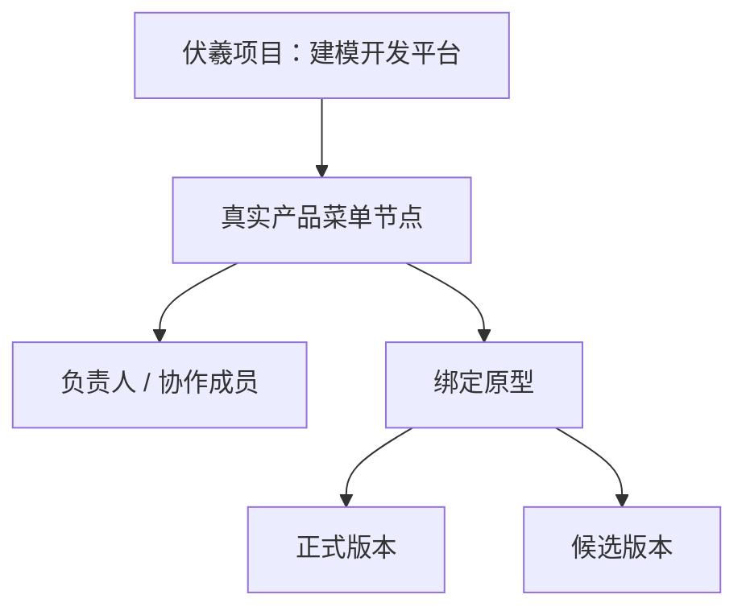
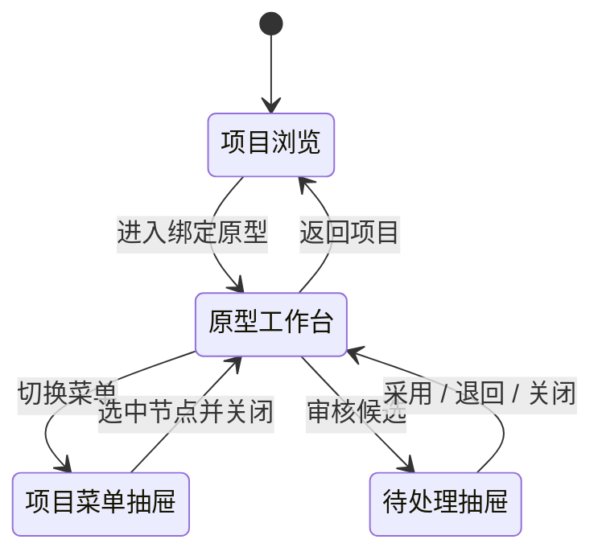

# 项目工作台 Canvas-first 设计说明

## 1. 任务背景

伏羲平台里的“项目”不是通用项目管理，也不是一个额外的后台分类。它是一个真实平台/产品的原型聚合与轻量协同空间。

以“建模开发平台”为例：真实平台包含“业务域建模”和“权限管理中心”等功能模块；“业务域建模”又包含“实体建模、方法建模、接口建模”。不同模块可能由不同员工负责，一个复杂模块也可能由多人分工。伏羲项目需要让这些人围绕同一套真实产品菜单，分别维护绑定原型、发起 AI 修改、预览候选，并由负责人采用结果。

因此，项目菜单同时承担三种职责：

1. 真实产品的信息架构与导航。
2. 人员分工和协作范围的边界。
3. 原型绑定与切换入口。

菜单不能被删掉，也不能被降级为无意义的后台栏；问题在于它是否需要在用户专注查看原型时一直占据固定宽度。

## 2. 领域模型

具体示例：

| 菜单范围 | 菜单节点 | 典型负责人 | 绑定内容 |
|---|---|---|---|
| 业务域建模 | 实体建模 | 员工 A | 实体建模工作台原型 |
| 业务域建模 | 方法建模 | 员工 B | 方法建模工作台原型 |
| 业务域建模 | 接口建模 | 员工 C | 接口建模工作台原型 |
| 建模开发平台 | 权限管理中心 | wushengzhi | 权限管理中心 MVP |

必须维持的业务不变量：

- 菜单节点是导航、负责人范围与原型绑定点的统一标识。
- 点击叶子菜单节点时，显示该节点绑定的原型；未绑定时显示明确的空状态与有权限用户的绑定入口。
- 候选上传不会替换正式版本；只有负责人采用后才生成新正式版本。
- 当前菜单路径、绑定原型、正式版本与候选状态必须可回读，不能靠纯视觉假状态表达。

## 3. 原页面的核心问题

原页面不是“少一点留白”或“换个颜色”就能解决，根因是外壳嵌套：

- 平台全局顶部导航。
- 项目管理全局侧栏。
- 项目标题栏。
- 项目模块侧栏。
- 工作区工具栏。
- 原型预览边界容器。
- iframe 内部原型自己的顶部栏、菜单和内容。
- 右侧待处理/状态栏。

这些层级同时存在时，原型成为页面里的一张小卡片，实际只占可用空间的一小部分。原型自身通常已有导航和复杂内容，外围再保持多列常驻会造成：

- 视觉主次颠倒：管理外壳比工作对象更显眼。
- 水平空间被永久分割，1440px 屏幕上尤其明显。
- 多套导航争夺注意力，用户难以判断自己在操作伏羲、项目还是原型内部页面。
- 右侧状态信息低频却永久占宽；全屏按钮成了“救场入口”，而不是增强能力。
- 容易出现页面滚动、预览容器滚动、iframe 内滚动三层并存。

## 4. 被否决的方向与原因

### 4.1 方向一：只重排三栏

尝试保留左项目菜单、中间原型、右协作栏，只缩窄边栏、优化卡片。语义比原图更准确，但画布占比没有发生本质变化。

### 4.2 方向二：强化项目语义后继续三栏

把左栏改成真实平台菜单，并补充负责人、绑定原型和候选信息。领域模型更正确，但仍让左菜单和右协作同时常驻；用户反馈“跟原来一样，原型还是只占一小部分”。

这两次失败说明：本任务的验收不是“信息是否齐全”，而是“进入工作状态后画布是否真正成为主角”。如果布局骨架仍是三列，换文案、边框和卡片都不算解决。

历史图片保留在 `assets/`，只用于解释为何被否决，不得作为实现目标。

## 5. 选定方案：双模式，而不是永远三栏

### 5.1 模式 A：项目浏览态

用途：理解真实产品结构、切换模块、查看负责人和绑定关系、进入某个原型。

项目菜单在此模式可以常驻，因为用户正在做“看项目和选工作范围”这件事。主区展示当前菜单节点：

- 模块说明与负责人。
- 当前绑定原型与正式版本。
- 待处理候选数量。
- 与当前节点相关的协作动态。
- 主操作“进入原型工作台”。

项目浏览态不是把整个原型嵌在一张小卡里；缩略预览只用于识别，真正操作要进入工作台。

### 5.2 模式 B：原型工作台态

用途：查看正式/候选版本、在原型内部操作、发起 AI 修改、处理候选。

默认结构：

- 保留一条紧凑上下文栏，表达“项目 / 菜单路径 / 原型 / 版本”。
- 保留一条紧凑预览工具栏，放版本切换、设备宽度、适配宽度、让 AI 修改。
- 其余区域尽可能交给 iframe 原型画布。
- “项目菜单”点击后从左覆盖打开抽屉。
- “待处理”点击后从右覆盖打开抽屉。
- 两个抽屉互斥；打开一个时关闭另一个。
- 抽屉覆盖画布但不改变画布布局宽度，关闭后恢复完整画布。
- 专注/全屏模式只进一步隐藏平台导航，是增强能力，不承担修复默认布局的责任。

## 6. 页面层级与交互

### 6.1 项目浏览态

1. 进入 `/project/:id`。
2. 左侧项目菜单默认选中第一个有效叶子节点，或恢复路由/上次选中的菜单路径。
3. 点击节点后更新当前绑定、负责人、版本、待处理数与动态。
4. 点击“进入原型工作台”进入当前节点的预览工作区；菜单路径应放入路由参数、query 或可恢复状态，刷新后不能随机回到另一个节点。
5. 无绑定节点使用空状态，不显示伪造预览。

### 6.2 原型工作台态

1. 进入 `/project/:id/preview` 并恢复当前菜单路径。
2. 默认所有抽屉关闭，画布占据主体。
3. 点击“项目菜单”打开左抽屉；如果右抽屉已开，先关闭右抽屉。
4. 在抽屉中选择菜单节点后，更新绑定原型与预览 URL并自动关闭抽屉。
5. 点击“待处理”打开右抽屉；如果左抽屉已开，先关闭左抽屉。
6. 右抽屉复用当前候选、预览 Smoke、采用、退回与过期保护逻辑，不改变现有权限和状态机。
7. “正式版/候选版”切换必须对应真实数据；如果当前没有可预览候选，不显示可点击的伪标签。
8. 点击“让 AI 修改”复用现有任务创建流程。
9. 点击“返回项目”回到项目浏览态，并保留当前菜单节点。

### 6.3 状态与文案原则

- 一处权威状态：同一层级不要重复显示多个“正式版”“待确认”徽标。
- 用业务语言：修改、候选、预览、采用、退回、过期。默认隐藏 CAS、hash、目录和内部状态码。
- 风险说明贴近决策：在“采用”附近说明会生成新正式版本；过期时告诉用户需要基于最新版重新发起。
- 待处理数量是入口提示，不是常驻面板的理由。

## 7. 布局与视觉原则

### 7.1 核心原则

- Canvas first：用户进入原型工作台后，iframe 是第一视觉层级。
- Context, not chrome：伏羲外壳只提供必要上下文和操作，不与原型内部 UI 竞争。
- Progressive disclosure：低频菜单、审核、动态按需展开。
- One screen, one main task：项目浏览主任务是选范围；原型工作台主任务是看和改原型。
- Preserve product IA：减少常驻宽度不等于删除真实产品菜单。
- Reuse before invent：优先复用 Element Plus、既有 API、权限和候选流程。

### 7.2 尺寸原则

- 1440px 及以上桌面宽度时，默认关闭抽屉后，原型预览应占工作区可用宽度至少 80%。
- 原型预览应占扣除平台导航和两条紧凑工具栏后可用高度至少 75%。
- 平台外壳在 1440px 不应出现横向滚动。
- 上下文栏与预览工具栏应紧凑；不要继续叠加项目大标题、第二套卡片标题和冗余边界栏。
- iframe 内部可滚动；默认不再制造一个同方向的外层滚动区。
- 抽屉宽度以能完成任务为准，建议左侧约 320–360px，右侧约 380–420px；打开时覆盖画布。

### 7.3 响应式原则

- 小屏可隐藏文字，仅保留图标与可访问标签。
- 抽屉在窄屏可占更高比例，但仍不与另一侧同时打开。
- 设备预览是 iframe 宽度模拟，不应让整个工作区产生横向滚动。

## 8. 对现有代码的实现映射

本节是起点，不是要求机械照抄；Codex 必须先核对分支上的最新代码。

| 现有位置 | 当前职责 | 建议改法 |
|---|---|---|
| `frontend/src/views/ProjectView.vue` | 项目门户、固定菜单、内嵌预览、AI 任务与候选管理 | 收敛为项目浏览态；保留菜单、负责人、绑定和协作概览；主操作进入工作台，不再把完整操作型 iframe 挤在三栏里 |
| `frontend/src/views/ProjectPreview.vue` | 全屏预览，固定左侧菜单 | 演进为原型工作台；菜单改为左覆盖抽屉，候选/待处理改为右覆盖抽屉，默认画布最大化 |
| `frontend/src/router/index.js` | `/project/:id` 与 `/project/:id/preview` | 延续现有路由，加入可恢复的菜单路径；避免为了模式切换创建平行重复页面 |
| `frontend/src/api/projects` | 项目门户、菜单、绑定、候选数据 | 原样复用；本任务不新增后端契约 |
| Element Plus | 按钮、标签、Dialog 等 | 优先使用 `el-drawer`、现有按钮/标签/空状态；不引入第二套组件库 |

可以在确有复用价值时抽取共享项目菜单组件，但不要为了“架构漂亮”重构无关页面。首先完成一个可用纵向切片：项目浏览 → 进入工作台 → 左抽屉切节点 → 右抽屉处理候选 → 返回项目。

## 9. 硬性验收标准

### 9.1 功能

- 项目浏览态显示真实产品菜单层级、当前节点负责人和绑定原型。
- 点击不同叶子节点能切换到对应绑定或空状态。
- 从当前节点进入原型工作台后，刷新仍能恢复项目、菜单路径和绑定原型。
- 原型工作台默认不常驻左右两栏。
- 左项目菜单与右待处理抽屉互斥，且均为覆盖式，不缩窄画布布局。
- 正式/候选切换、AI 修改、采用、退回继续遵循现有权限和候选状态机。
- 返回项目后保留当前菜单上下文。

### 9.2 布局

- 在 1440×900 验证：默认画布宽度 / 工作区主体宽度 ≥ 0.80。
- 在 1440×900 验证：默认画布高度 / 扣除导航和工具栏后的可用高度 ≥ 0.75。
- 在 1440px 宽度，平台 shell 的 `scrollWidth <= clientWidth`。
- 默认页面没有“固定左项目菜单 + 中间画布 + 固定右协作栏”的三栏骨架。
- 专注/全屏关闭时默认布局也应合格。

### 9.3 工程

- `cd frontend && npm run build` 通过。
- 不引入 React、Tailwind、Shadcn 或参考站依赖。
- 不改后端、数据库、MCP、发布脚本和生产配置。
- 不写入凭证、token、内网账号或新默认密码。
- 不删除或绕过现有权限、候选 Smoke、基础版本 CAS 与过期保护。

## 10. 明确不做

- 不重新设计整个伏羲全局导航。
- 不实现通用任务看板、实时协作、CRDT 或代码编辑器。
- 不扩展多原型 release、Git 分支/MR 流程或自动合并。
- 不修改候选版本号算法、后端状态机或数据表。
- 不为了这个页面升级 Vue、Element Plus 或引入新设计系统。
- 不部署测试或生产环境，不创建 release，不合并 `master/main`。
- 不把历史被否决图片当作最终视觉规范。

## 11. 视觉复核协作约定

本地 Codex 的职责是基于代码、DOM 尺寸和构建结果完成实现，不承担截图审美判断。需要视觉复核时：

1. Codex 告知用户应打开的路由、窗口尺寸和要验证的状态。
2. 用户自行截图并发给 ChatGPT。
3. ChatGPT 根据截图给出文字改动意见。
4. 用户再把文字意见交给 Codex。

不要让 Codex读取 `assets/` 中的图片来猜测设计，也不要以“无法看图”为由停工；本文件、任务提示词和参考源码已经提供完整文字规范。

## 12. 成功定义

成功不是“页面更现代”，而是下面这件事成立：用户从项目菜单选中自己负责的功能模块后，进入工作台即可把绝大多数屏幕用于查看和修改绑定原型；需要切模块或处理候选时再临时拉出协作工具，关闭后工作对象立即恢复为主角。

