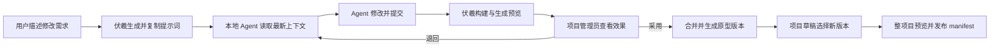
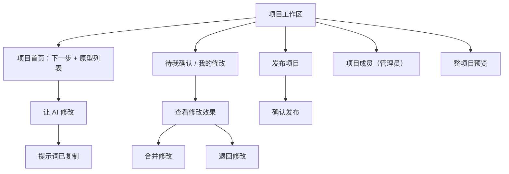
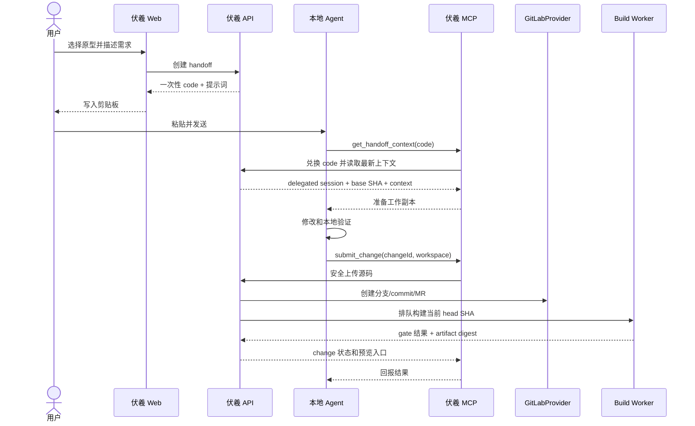
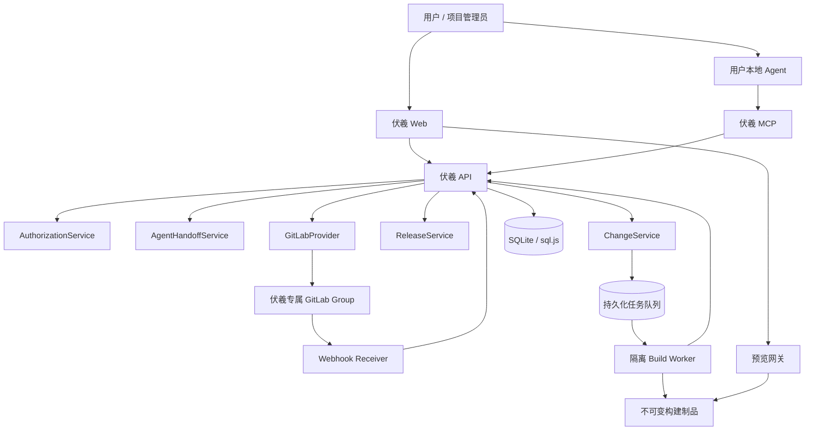
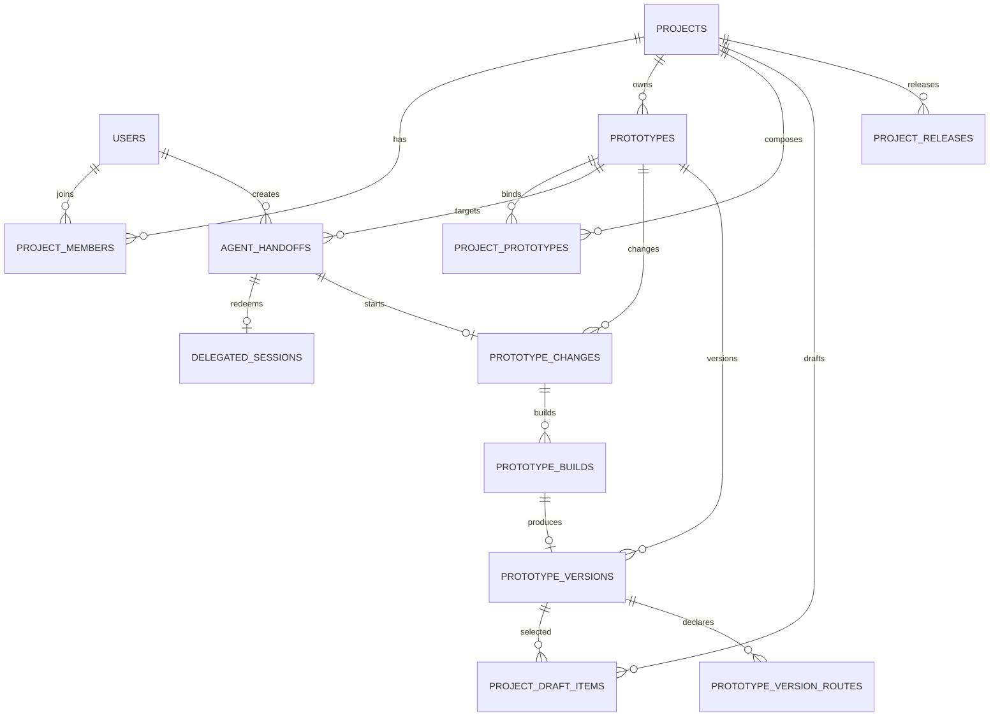
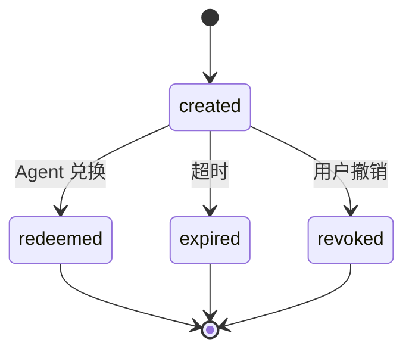
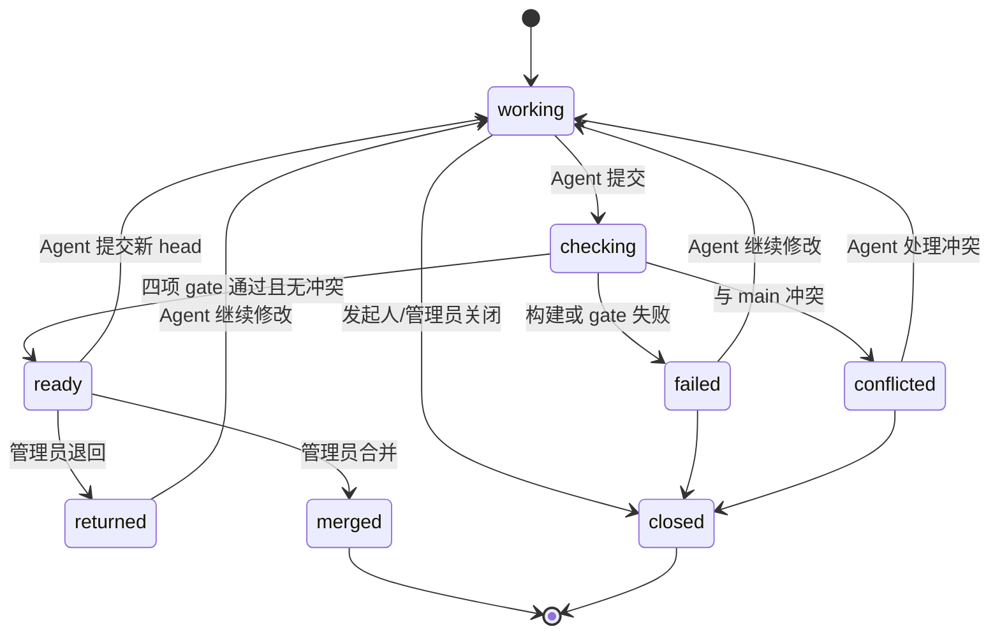

# 伏羲团队协同模块全量设计

> **已被替代（2026-08-20）**：Git/GitLab 不再是当前 MVP 的事实源或验收门禁。当前实施契约为 [无 Git 轻协作 MVP](../lightweight-collaboration-mvp/FULL_DESIGN.md)；本文仅作为历史决策与未来可选增强保留。

> 状态：MVP 详细设计基线<br>
> 日期：2026-08-14<br>
> 对应交互原型：[index.html](./index.html)<br>
> 设计目标：让多个用户通过各自的本地 AI Agent 并行修改同一项目中的原型，同时让 Git、分支、构建、MR、权限和版本锁定退到平台内部。

---

## 1. 文档地位

本文是团队协同 MVP 的产品与技术实施依据，覆盖：

- 产品定位、范围与原则；
- 用户角色、核心旅程与页面交互；
- Agent 提示词交接与 MCP 契约；
- GitLab 仓库、分支、MR、构建与预览；
- 项目权限自动派生；
- 原型版本与项目不可变 manifest；
- 跨原型 `routeKey` 导航；
- 数据模型、API、状态机和系统不变量；
- 安全、异常、迁移、测试和实施拆解。

本文不替代平台体系级的 `docs/TECHNICAL_DESIGN.md`。本设计确认并实现后，应把稳定事实收口到体系文档；当前阶段以本文件记录待实现目标。

---

## 2. 第一性原理

### 2.1 用户真正要完成的事

协同模块的用户任务只有三类：

1. 把修改需求交给自己的本地 Agent；
2. 查看 Agent 产出的实际效果并决定是否采用；
3. 选择各原型版本并发布一套稳定项目。

Git、分支、commit、MR、流水线、权限同步和制品摘要是实现机制，不是用户任务。

### 2.2 产品定位

伏羲仍是 **AI 生产的原型的托管平台**，不是：

- 浏览器代码编辑器；
- 通用 Git 客户端；
- GitLab 的界面复制品；
- 实时多人同屏编辑器；
- 通用项目管理或任务看板；
- 在平台内托管和运行大模型的 Agent 平台。

### 2.3 设计原则

| 原则 | 落地规则 |
|---|---|
| 一屏一任务 | 首屏只显示下一步和项目原型，不显示统计、活动流和技术明细 |
| 正常链路零 Git | 主按钮使用“让 AI 修改、查看效果、合并修改、发布项目” |
| 渐进披露 | 构建、diff、commit、routeKey 只在审核详情或异常诊断中显示 |
| 显式升级 | 原型新版本不会自动改变任何已发布项目 |
| 不可变发布 | 原型版本锁定 commit 和制品；项目版本锁定整份 manifest |
| 冲突不猜测 | 平台检测和展示冲突，永不自动选择内容 |
| 权限内化 | 管理员只把人加入项目，平台按固定规则完成其余授权 |
| Agent 无治理权 | Agent 可以修改和提交，不能管理成员、合并或发布 |
| 最新事实回读 | 复制提示词只携带任务入口，Agent 执行前必须读取最新上下文 |

---

## 3. 已确认决策

1. V1 是 Git 分支驱动的异步协作，不做实时同屏编辑。
2. 一个原型一个远程 Git 仓库。
3. 项目只组合原型，并精确锁定原型版本。
4. Git 中的可编辑源码是权威；预览构建物是可再生、不可变制品。
5. 仓库逻辑归伏羲所有，V1 物理托管于专属 GitLab 命名空间。
6. 禁止直接写 `main`；每项修改使用独立工作分支，通过 MR 集成。
7. 项目是唯一业务权限边界。
8. 平台管理员、项目管理员只负责把用户加入项目或指定项目管理员。
9. 项目成员自动获得项目内原型的修改能力；项目管理员额外拥有合并、发布和成员管理能力。
10. 所有原型创建与修改都由用户本地 Agent 执行，伏羲不提供网页代码编辑器。
11. 用户通过复制提示词把任务和伏羲上下文入口交给本地 Agent。
12. 平台只检测和展示 Git 冲突，不自动解决。
13. 合并固定检查：构建、预览、导航契约、安全内容。
14. 合并 `main` 自动生成原型版本；项目必须手动选择后才升级。
15. 原型独立构建；跨原型通过 `routeKey + navigate` 进行页面跳转。

---

## 4. MVP 范围

### 4.1 必须完成的纵向闭环



### 4.2 MVP 包含

- 项目成员添加/移除与固定权限判定；
- 为项目内原型供应伏羲自有 GitLab 仓库；
- “让 AI 修改”及可复制的 Agent 任务提示词；
- Agent 获取上下文、下载工作副本、提交修改的 MCP 工具；
- 每项修改独立分支和 MR；
- 固定四项合并检查及分支预览；
- 冲突检测、失败说明、退回与重新提交；
- `main` 合并后生成不可变原型版本；
- 项目草稿显式选择原型版本；
- 项目不可变发布 manifest 和发布版本切换；
- `routeKey + navigate` 跨原型跳转及发布前校验；
- 旧原型的受控试点迁移。

### 4.3 MVP 明确不做

- 浏览器代码编辑器；
- 用户直接操作 GitLab；
- 自定义角色、ABAC、ReBAC 或独立策略引擎；
- Agent 实时聊天、编排或模型托管；
- 自动解决 Git 内容冲突；
- 原型间源码引用、DOM 操作和任意共享状态；
- 多级人工审批、代码所有者和复杂审批策略；
- 通用任务看板、工时、排期和通知中心；
- 自动兼容性求解和跨原型依赖图；
- 移动端管理功能。

---

## 5. 角色和固定权限

### 5.1 角色

| 角色 | 来源 | 责任 |
|---|---|---|
| 平台管理员 | 用户全局角色 | 用户、项目和项目管理员管理；故障介入 |
| 项目管理员 | 项目成员关系 | 添加成员、查看/退回/合并修改、发布项目 |
| 项目成员 | 项目成员关系 | 发起修改、把提示词交给 Agent、查看和提交自己的修改 |
| 本地 Agent | 用户短期委托 | 获取上下文、修改、验证、提交；无治理权限 |

### 5.2 权限矩阵

| 操作 | 平台管理员 | 项目管理员 | 项目成员 | Agent |
|---|---:|---:|---:|---:|
| 查看项目与原型 | ✓ | ✓ | ✓ | 委托范围内 |
| 添加/移除项目成员 | ✓ | ✓ | — | — |
| 发起 Agent 修改 | ✓ | ✓ | ✓ | — |
| 读取源码上下文 | ✓ | ✓ | ✓ | 委托范围内 |
| 创建工作分支并提交 | ✓ | ✓ | ✓ | 委托范围内 |
| 查看修改预览 | ✓ | ✓ | ✓ | ✓ |
| 退回或合并修改 | ✓ | ✓ | — | — |
| 编辑项目草稿版本 | ✓ | ✓ | — | — |
| 发布/回滚项目版本 | ✓ | ✓ | — | — |
| 删除/转移项目 | ✓ | 项目归属管理员 | — | — |

### 5.3 权限实现原则

- V1 使用固定角色和固定权限矩阵。
- 权限检查统一进入 `AuthorizationService.can(actor, action, resource)`。
- Web API、MCP 和后台任务不得各写一套判断。
- Agent 权限是委托用户权限与 handoff scope 的交集。
- 每个原型必须有唯一 `project_id`；其他项目只能引用其已发布版本，不能获得修改能力。
- GitLab 是内部存储，不要求伏羲用户拥有 GitLab 账号；GitLab 写操作只由伏羲服务账号执行。

---

## 6. 用户旅程与交互设计

## 6.0 信息架构



| 页面/浮层 | 主要用户 | 唯一主任务 | 默认隐藏的信息 |
|---|---|---|---|
| 项目首页 | 所有人 | 进入下一步或发起 AI 修改 | Git、构建、统计、活动流 |
| 让 AI 修改 | 所有人 | 描述目标并复制提示词 | 分支名、token、仓库 URL |
| 提示词已复制 | 所有人 | 粘贴到本地 Agent | 完整提示词正文 |
| 待我确认 | 项目管理员 | 选择一项查看效果 | 文件 diff、流水线步骤 |
| 修改详情 | 管理员/发起人 | 基于预览采用或退回 | 原始日志、Provider 细节 |
| 发布项目 | 项目管理员 | 选择版本并发布 | commit SHA（可展开查看） |
| 项目成员 | 项目管理员 | 添加或移出人员 | 仓库级权限配置 |
| 整项目预览 | 所有人 | 验证组合效果和跳转 | artifact 地址、route 解析细节 |

## 6.1 项目首页

**用户问题：** 我现在需要做什么？

页面只包含：

1. 项目名称与当前发布版本；
2. 唯一主按钮“让 AI 修改”；
3. 若有待办，显示一张“下一步”卡；
4. 项目原型列表及每个原型的一个当前状态；
5. “整项目预览”次按钮。

不显示：

- 项目统计卡；
- 活动时间线；
- 分支、commit、MR 编号；
- 构建步骤和检查详情；
- GitLab 链接和权限同步信息；
- 无待办意义的健康度指标。

### 原型状态文案

| 内部状态 | 首页文案 | 主操作 |
|---|---|---|
| idle | 稳定 | 打开原型 |
| agent_working / build_running | 进行中 | 无，避免干扰 |
| ready | 待确认 | 查看效果 |
| conflicted | 已暂停 | 查看原因 |
| version_available | 有新版本 | 准备发布 |

## 6.2 “让 AI 修改”弹窗

字段只有两个：

- 目标原型：项目内原型单选；
- 修改目标：自然语言多行输入。

主按钮：**生成并复制给 Agent**。

点击后：

1. 创建 `agent_handoff`；
2. 固化用户输入，但不固化完整源码上下文；
3. 生成短期 handoff code；
4. 将任务提示词写入剪贴板；
5. 显示“提示词已复制”；
6. 指示用户打开本地 Agent、粘贴并发送。

如果浏览器拒绝写剪贴板，界面必须退化为可选中的只读文本框和“手动复制”提示，不能显示“已复制”。handoff 创建失败时不生成或展示伪提示词。

“提示词已复制”页面默认不展示长提示词，只提供：

- 完成；
- 再次复制；
- 折叠的“提示词包含什么”。

## 6.3 本地 Agent 衔接

用户粘贴提示词后，Agent 应自动：

1. 检查伏羲 MCP 是否已连接；
2. 用 handoff code 获取短期委托会话；
3. 获取项目、原型、基线 commit、规范和 route contract；
4. 在本地准备工作目录；
5. 执行修改和本地验证；
6. 调用提交工具上传变更；
7. 返回 change ID、检查状态和伏羲预览入口。

用户不需要复制仓库 URL、创建分支或管理 token。

## 6.4 修改列表

默认只列与当前用户有关或需要当前管理员处理的修改，不提供复杂筛选器。

每项只展示：

- 修改名称；
- 原型名称；
- 发起人；
- 业务状态；
- 一个上下文操作。

不在列表展示文件数、commit SHA、流水线步骤或 routeKey 数量。

## 6.5 修改详情

主区域：本次修改的独立预览。<br>
侧栏：四项平台检查的汇总结果。<br>
底部：退回、查看代码差异、合并修改。

合并前必须再次向后端读取：

- MR 仍然打开；
- head SHA 未改变；
- 与 `main` 无冲突；
- 四项检查均对应当前 head SHA；
- 当前用户仍是项目管理员。

任何条件变化都停止合并并刷新页面，不使用过期 UI 状态继续操作。

## 6.6 冲突状态

主文案：**这项修改已暂停，主版本没有受到影响。**

向项目成员展示：

- 哪个文件或模块存在重叠；
- 回到原 Agent 工作区处理的按钮；
- 处理后将自动重新检查。

向项目管理员展示：

- 提醒发起人；
- 关闭修改；
- 不提供“强制覆盖”按钮。

## 6.7 项目发布

页面由两部分组成：

1. 原型列表：当前发布版本和草稿选择版本；
2. 发布确认：制品可用、导航有效、整项目预览完成。

原型升级必须显式选择。发布操作生成新的不可变 manifest，不移动或覆盖旧版本。

## 6.8 成员管理

项目管理员仅完成：

- 搜索用户；
- 添加为项目成员；
- 移出项目；
- 指定或撤销项目管理员。

界面不显示仓库级权限矩阵。平台在后台按项目关系判断 MCP/API 权限。

## 6.9 PC 与无障碍

- MVP 面向 PC 管理台，设计宽度 1280–1600 px，最低 1180 px。
- 所有状态必须同时使用文本，不只依赖颜色。
- 弹窗打开后焦点进入首个控件，关闭后返回触发按钮。
- 主流程支持键盘 Tab、Enter、Escape。
- 普通正文对比度目标不低于 4.5:1。
- 动态状态通过 `aria-live="polite"` 通知，但不反复播报构建轮询。

---

## 7. Agent 提示词交接设计

## 7.1 为什么不复制完整上下文

完整源码、当前分支、项目成员和版本状态在复制后都可能变化。提示词只携带稳定标识、用户目标和一次性 handoff code；Agent 必须执行回读，平台回读结果才是权威事实。

## 7.2 提示词模板

```text
请使用伏羲平台完成下面的原型修改任务。

项目：{{projectName}}
目标原型：{{prototypeName}}
修改需求：{{requirement}}
伏羲地址：{{fuxiBaseUrl}}
任务交接码：{{handoffCode}}

执行规则：
1. 先通过伏羲 MCP 兑换交接码并读取项目、原型和主版本的最新上下文。
2. 不要把本提示词中的状态当作最新事实。
3. 在伏羲分配的独立工作空间完成修改，不得直接写 main。
4. 遵守返回的原型规范、依赖约束和 routeKey 契约。
5. 完成构建、预览、页面跳转和敏感内容检查。
6. 提交修改并发起审核；不得自行合并或发布项目。
7. 如发现内容冲突，停止自动合并并清楚报告冲突位置。
```

## 7.3 handoff code

- 随机强度：至少 128 bit；
- 明文只在创建响应中返回一次；数据库只保存哈希；
- 默认有效期：10 分钟；
- 单次兑换；
- scope 固定为 `projectId + prototypeId + submit_change`；
- 兑换后生成短期 delegated session；
- delegated session 默认 2 小时，可由发起人撤销；
- 不允许管理成员、合并、发布、删除和转移；
- code、session 和 refresh token 不写入仓库、提示词日志或构建日志。

如果本地 MCP 已持有用户的有效设备会话，handoff code 仍用于绑定任务 scope，但不重复创建长期凭据。

## 7.4 Agent 交接时序



## 7.5 上下文包

`get_handoff_context` 返回：

- project：ID、名称、菜单和当前发布版本；
- prototype：ID、名称、仓库类型、技术栈；
- base：完整 `main` commit SHA；
- work：change ID、预留分支名、幂等键；
- requirements：用户输入；
- conventions：README、AGENTS.md、适用原型 Skill 标识；
- routes：当前项目 route contract；
- commands：安装、构建和测试命令；
- restrictions：禁止文件、敏感内容和目录边界；
- submit contract：必须回传的验证证据。

正文文件按需读取，不把整个仓库塞入一次 MCP 响应。

---

## 8. 目标系统架构



### 8.1 组件职责

| 组件 | 职责 | 不负责 |
|---|---|---|
| AuthorizationService | 固定角色权限、Agent scope | GitLab 角色推导 |
| AgentHandoffService | 提示词、code、上下文、委托会话 | 执行模型调用 |
| GitLabProvider | 仓库/分支/MR/合并/Webhook 适配 | 产品权限决策 |
| ChangeService | 修改生命周期、幂等、检查汇总 | 构建源码 |
| Build Worker | 隔离安装、构建、扫描、制品打包 | 直接写业务数据库 |
| ReleaseService | 原型版本、项目草稿、不可变 manifest | 回滚 Git 仓库 |
| Preview Gateway | 按 artifact digest 提供预览 | 解析用户权限之外的源码 |
| RouteContractService | route 声明、解析、项目级校验 | 跨原型任意状态同步 |

### 8.2 GitLab 作为内部 Provider

V1 使用 GitLab REST API 和 Git over HTTPS，但必须通过 `GitProvider` 接口封装，业务层不出现 `github_url` 或 GitLab 专有字段。

GitLab Provider 需要的能力：

- 创建私有项目到固定 namespace；
- 初始化 `main`；
- 创建工作分支；
- 写入/推送 commit；
- 创建、读取、关闭和合并 MR；
- 查询 diff、merge status 和 head SHA；
- 配置受保护分支；
- 接收 push、MR 和 pipeline Webhook；
- 下载指定 commit 的源码归档。

官方能力依据：

- [Projects API](https://docs.gitlab.com/api/projects/)
- [Branches API](https://docs.gitlab.com/api/branches/)
- [Protected branches API](https://docs.gitlab.com/api/protected_branches/)
- [Merge requests API](https://docs.gitlab.com/api/merge_requests/)
- [Project webhooks](https://docs.gitlab.com/api/project_webhooks/)

### 8.3 GitLab 凭据

- 使用伏羲专属 Group Access Token 或等价服务账号；
- scope 仅限伏羲 Group，启用 API；如后端使用 Git CLI，再增加 `write_repository`；
- token 只存在环境变量或密钥存储，不写 SQLite；
- 设置明确有效期并提前告警轮换；
- 不把服务 token 交给浏览器、MCP 客户端或 Agent；
- 所有 Provider 日志清除 URL 内凭据和认证头。

### 8.4 `main` 保护

- `main` 禁止直接 push；
- 禁止 force push；
- 只有伏羲服务账号具备 GitLab 层合并能力；
- 人类项目管理员在伏羲点击“合并”，后端重新检查权限和 gates 后代表其调用 GitLab；
- 合并审计同时记录业务操作者和 GitLab 服务账号；
- 即使用户知道 GitLab 地址，也不能绕过伏羲检查修改 `main`。

---

## 9. Git 与修改生命周期

## 9.1 仓库规则

- 一个原型一个仓库；
- 默认分支固定为 `main`；
- 工作分支命名：`work/<changeId>-<slug>`；
- `main` 只保存可编辑源码和规范，不提交 `dist/`；
- 纯静态原型的 HTML/CSS/JS 本身视为源码；
- 必须提交依赖锁文件；
- `.gitignore` 必须排除凭据、依赖目录和构建产物。

## 9.2 创建修改

点击“生成并复制给 Agent”只创建 handoff，不立即创建空分支。

Agent 兑换 handoff 时：

1. 读取当时最新 `main` SHA；
2. 原子创建 `prototype_changes` 记录；
3. 生成唯一分支名；
4. 返回源码工作副本；
5. 把 base SHA 写入 `.fuxi/change.json`，其中不含凭据。

这样用户复制提示词但从未粘贴时不会留下空分支。

## 9.3 本地工作副本

V1 推荐通过 MCP 下载指定 base SHA 的源码归档，不向 Agent 暴露 GitLab token。

本地目录结构：

```text
<workspace>/
├── .fuxi/change.json      # changeId/baseSha/prototypeId，无凭据
├── src/
├── package.json
├── lockfile
├── README.md
└── ...
```

Agent 可以使用本地 Git 记录自己的工作，但提交伏羲时以 `.fuxi/change.json` 为目标身份，后端负责写入权威远端分支。

## 9.4 提交修改

`submit_change`：

1. 校验 handoff/session、项目成员关系和目录边界；
2. 校验 base SHA、change ID 和幂等键；
3. 打包源码，排除 `.git`、凭据、依赖目录、构建产物和超大文件；
4. 后端在隔离临时目录检出工作分支；
5. 用上传源码替换工作树并计算 diff；
6. 无变化则返回 `NO_CHANGES`；
7. 提交并推送分支；
8. 创建或更新同一个 MR；
9. 为当前 head SHA 创建 build job；
10. 返回 change ID 和状态页。

同一幂等键重复提交返回原结果，不创建重复 commit/MR。

## 9.5 冲突

- GitLab merge status 或本地 merge-tree 检测冲突；
- 冲突后 `change.status=conflicted`；
- 平台不写冲突文件、不选择 ours/theirs、不自动 rebase；
- Agent 重新获取 `main` 和冲突清单，在原 change 上提交修复；
- 新 head SHA 使旧构建结果失效，必须重新执行全部 gates。

## 9.6 合并

合并接口必须使用乐观锁：`expectedHeadSha`。

后端顺序：

1. 权限校验；
2. 读取 GitLab MR 最新状态；
3. 比较 expected/head SHA；
4. 确认无冲突；
5. 确认当前 head SHA 的四项 gate 全绿；
6. 调用 GitLab merge；
7. 等待 Webhook 或主动回读确认 merged commit SHA；
8. 为 merged commit 创建原型版本；
9. 保留 MR 和分支审计；可异步删除已合并工作分支。

任何一步失败都不能伪造“已合并”。

---

## 10. 构建、检查和制品

## 10.1 四项固定 gate

| Gate | 通过条件 | 用户层文案 |
|---|---|---|
| build | 锁文件安装成功；buildCommand 退出码 0 | 平台检查通过/构建失败 |
| preview | 存在入口文件；静态资源可加载；基础页面 smoke 通过 | 效果可以查看/页面无法打开 |
| routes | 声明格式合法；项目内所有目标可解析 | 页面跳转有效/存在失效跳转 |
| security | 无凭据、私钥、`.env`、禁止目录和超限文件 | 内容安全/发现不能提交的内容 |

仓库自带测试存在时执行并记录；MVP 不强制每个原型必须有测试。

## 10.2 Build Worker 隔离

AI 生成源码视为不可信代码。Build Worker 必须：

- 独立于 API 进程；
- 使用一次性容器或等价沙箱；
- 非 root 用户；
- 限制 CPU、内存、磁盘和执行时间；
- 无平台数据库、环境变量和服务 token；
- 网络默认关闭，仅依赖安装阶段允许访问指定内部 npm registry；
- 构建完成后销毁工作目录；
- stdout/stderr 限长并脱敏；
- 制品按 digest 写入不可变目录。

建议目标限制（实施时可配置）：2 CPU、2 GiB 内存、2 GiB 临时磁盘、安装与构建总时长 10 分钟。

## 10.3 制品身份

每个通过构建的 head SHA 生成：

```json
{
  "prototypeId": "proto-123",
  "commitSha": "40-char-sha",
  "artifactDigest": "sha256:...",
  "entryFile": "index.html",
  "routesDigest": "sha256:...",
  "buildProfile": "vue3-skyui-v1",
  "createdAt": "ISO-8601"
}
```

同一 `prototypeId + commitSha + buildProfile` 构建结果可复用；制品内容不允许覆盖写。

---

## 11. 原型版本与项目 manifest

## 11.1 原型版本

MR 合并后，merged commit 的 gate 成功即创建原型版本：

```text
prototype_version = prototype_id
                  + sequence_number
                  + commit_sha
                  + artifact_digest
                  + route_contract_digest
```

- sequence number 只用于用户阅读；
- commit SHA 和 artifact digest 才是身份；
- 同一 commit 幂等创建一个版本；
- 原型版本创建后不可改指向，只能补充说明或标记不可用。

## 11.2 项目草稿

项目草稿保存每个菜单绑定选择的 `prototype_version_id`，不读取“原型最新版本”。

新原型版本出现时：

- 项目草稿不自动改变；
- UI 显示“有新版本”；
- 项目管理员显式选择后，草稿 revision +1；
- 重新执行 route 校验和整项目预览。

## 11.3 项目发布 manifest

```json
{
  "schemaVersion": 1,
  "projectId": "project-tiangong",
  "release": "1.5",
  "menu": ["..."],
  "items": [
    {
      "menuPath": "customer/detail",
      "prototypeId": "proto-customer",
      "prototypeVersionId": 24,
      "commitSha": "...",
      "artifactDigest": "sha256:...",
      "entryFile": "index.html"
    }
  ],
  "routesDigest": "sha256:...",
  "createdBy": 14,
  "createdAt": "ISO-8601"
}
```

发布前事务内验证：

- draft revision 未变化；
- 每个菜单叶子有且只有一个版本；
- 所有版本属于项目归属原型；
- 所有制品存在且 gate 通过；
- route graph 完整；
- 完整 manifest digest 唯一。

## 11.4 回滚

项目回滚只把 `projects.published_release_id` 切换到旧 release；不回滚原型仓库、不覆盖制品、不改变其他项目。

---

## 12. 跨原型导航

## 12.1 route contract

每个原型源码声明 `.fuxi/routes.json`：

```json
{
  "schemaVersion": 1,
  "exports": [
    {
      "key": "customer.detail",
      "path": "/customers/:id",
      "params": {
        "id": { "type": "string", "required": true }
      }
    }
  ],
  "uses": [
    {
      "key": "order.detail",
      "params": ["id"]
    }
  ]
}
```

V1 只支持：

- 全局稳定 routeKey；
- 字符串、数字、布尔值的扁平参数；
- 项目壳内页面跳转、返回和浏览器历史；
- 发布前静态存在性与参数名检查。

不支持：

- 原型间源码 import；
- 直接访问另一个原型的真实制品 URL；
- 跨 iframe DOM；
- 任意对象、函数或凭据参数；
- 共享内存状态。

## 12.2 浏览器桥

原型调用：

```js
window.Fuxi.navigate('customer.detail', { id: 'C-10086' })
```

底层通过受控 `postMessage` 与项目壳通信：

```json
{
  "type": "fuxi:navigate",
  "schemaVersion": 1,
  "routeKey": "customer.detail",
  "params": { "id": "C-10086" }
}
```

项目壳必须验证：

- 消息来源是当前挂载 iframe；
- schemaVersion 支持；
- routeKey 存在于当前发布 manifest；
- 参数满足声明；
- 解析得到的制品属于当前项目发布；
- 跳转 URL 不接受原型传入的 host、protocol 或文件路径。

---

## 13. 数据模型

以下为目标逻辑模型；实施时通过增量迁移保留旧表和数据。

## 13.1 现有表调整

### `projects`

新增：

| 字段 | 说明 |
|---|---|
| `published_release_id` | 当前发布项目版本，可空 |
| `draft_revision` | 项目草稿乐观锁，默认 0 |
| `collaboration_mode` | `legacy_checkout` / `git_agent` |

### `project_members`

`role` 收敛为 `admin` / `member`。创建者默认 `admin`，平台管理员通过全局角色旁路判定。

### `prototypes`

新增：

| 字段 | 说明 |
|---|---|
| `project_id` | 唯一归属项目 |
| `repo_provider` | V1 固定 `gitlab` |
| `repo_external_id` | GitLab project ID |
| `repo_path` | provider 内路径，不含凭据 |
| `default_branch` | 固定 `main` |
| `collaboration_status` | provisioning/ready/failed/legacy |

现有 `github_url` 保留兼容读取，不再作为新协作仓库权威字段。

### `prototype_versions`

新增：

| 字段 | 说明 |
|---|---|
| `commit_sha` | 完整 Git commit SHA |
| `build_id` | 对应构建 |
| `artifact_digest` | 不可变制品摘要 |
| `routes_digest` | route contract 摘要 |
| `source_kind` | git / legacy_upload |

## 13.2 新增表

### `agent_handoffs`

`id, code_hash, project_id, prototype_id, created_by, requirement, status, expires_at, redeemed_at, delegated_session_id, created_at`

唯一约束：`code_hash`。状态：`created/redeemed/expired/revoked`。

### `delegated_sessions`

`id, user_id, project_id, prototype_id, handoff_id, token_hash, scopes_json, expires_at, revoked_at, created_at, last_used_at`

### `prototype_changes`

`id, project_id, prototype_id, handoff_id, title, requirement, created_by, branch_name, base_sha, head_sha, mr_iid, status, current_build_id, merged_sha, created_at, updated_at, merged_at, closed_at`

唯一约束：`prototype_id + branch_name`；`handoff_id` 唯一。

### `prototype_builds`

`id, prototype_id, change_id, commit_sha, profile, status, artifact_digest, entry_file, routes_digest, gate_results_json, log_excerpt, queued_at, started_at, finished_at`

唯一约束：`prototype_id + commit_sha + profile`。

### `project_draft_items`

`project_id, project_prototype_id, prototype_version_id, updated_by, updated_at`

主键：`project_id + project_prototype_id`。

### `project_releases`

`id, project_id, version_number, manifest_json, manifest_digest, created_by, created_at, status`

唯一约束：`project_id + version_number`、`manifest_digest`。

### `prototype_version_routes`

`prototype_version_id, direction, route_key, path, params_json`

`direction=export/use`。

### `webhook_events`

`provider, event_id, event_type, payload_digest, status, received_at, processed_at, error`

唯一约束：`provider + event_id`，用于 Webhook 至少一次投递去重。

### `audit_events`

`id, actor_user_id, delegated_session_id, action, resource_type, resource_id, result, metadata_json, created_at`

metadata 不保存 token、源码和完整提示词。

## 13.3 sql.js 并发约束

当前数据库每次写入导出整个 DB。MVP 必须：

- 所有业务写经过单一串行写队列；
- 多表操作封装 `runInTransaction`，成功后只保存一次；
- Build Worker 不直接打开 DB，只回调 API；
- Webhook 先插入去重事件再处理；
- 唯一约束承担最终幂等兜底；
- 不启动多个共享同一 `app.db` 的后端进程。

若并发量超出单进程模型，再单独迁移原生 SQLite/Postgres；不在 MVP 同时重写数据库。

## 13.4 核心实体关系



---

## 14. API 设计

所有写接口支持 `Idempotency-Key`；冲突返回稳定错误码和 `409`。

## 14.1 Web API

| 方法 | 路径 | 权限 | 用途 |
|---|---|---|---|
| POST | `/api/projects/:id/members` | project_admin | 添加项目成员 |
| DELETE | `/api/projects/:id/members/:userId` | project_admin | 移出成员并撤销委托会话 |
| POST | `/api/projects/:id/handoffs` | project_member | 生成 Agent handoff 和提示词 |
| GET | `/api/projects/:id/changes` | project_member | 获取与用户相关修改；管理员获取待确认修改 |
| GET | `/api/changes/:id` | project_member | 修改详情、预览和 gate 汇总 |
| POST | `/api/changes/:id/return` | project_admin | 退回修改 |
| POST | `/api/changes/:id/merge` | project_admin | 按 expectedHeadSha 合并 |
| POST | `/api/changes/:id/close` | creator/project_admin | 关闭未合并修改 |
| GET | `/api/projects/:id/draft` | project_member | 读取草稿 manifest |
| PUT | `/api/projects/:id/draft/items/:bindingId` | project_admin | 选择原型版本，带 expectedRevision |
| POST | `/api/projects/:id/releases` | project_admin | 发布不可变 manifest |
| POST | `/api/projects/:id/releases/:releaseId/activate` | project_admin | 切换到历史项目版本 |
| GET | `/api/previews/builds/:buildId/*` | 有项目访问权 | 分支预览 |
| GET | `/api/project/:id/portal` | 有访问权/分享契约 | 当前发布项目门户 |
| POST | `/api/integrations/gitlab/webhooks` | GitLab 签名 | Provider 事件入口 |

## 14.2 MCP 工具

### `get_handoff_context`

输入：`handoffCode`。<br>
输出：上下文包、delegated session、change ID、base SHA。<br>
副作用：单次兑换并创建 change；必须幂等处理网络重试。

### `prepare_change_workspace`

输入：`changeId, targetDir`。<br>
行为：下载 base SHA 源码并安全解压；目标目录必须为空或由同一 change 管理。<br>
输出：本地路径、构建命令、规范摘要。

### `submit_change`

输入：`changeId, projectPath, summary, validationEvidence, idempotencyKey`。<br>
行为：校验、过滤、上传、写工作分支、创建/更新 MR、排队构建。<br>
输出：change 状态和伏羲查看 URL。

### `get_change_status`

输入：`changeId`。<br>
输出：working/checking/ready/conflicted/failed/merged，以及用户可理解的 nextAction。

现有 `deliver_project` 和 checkout/snapshot 工具在 `legacy_checkout` 模式继续兼容；`git_agent` 模式必须拒绝旧签出写链路，避免双写。

## 14.3 错误码

| code | HTTP/MCP | 用户含义 |
|---|---|---|
| `HANDOFF_EXPIRED` | 410 | 提示词已过期，请在伏羲重新生成 |
| `HANDOFF_USED` | 409 | 该任务已被接收，返回现有 change |
| `PROJECT_ACCESS_DENIED` | 403 | 已不属于该项目 |
| `STALE_BASE` | 409 | 主版本已变化；重新读取上下文 |
| `NO_CHANGES` | 422 | 没有检测到需要提交的修改 |
| `CHANGE_CONFLICTED` | 409 | 修改与主版本冲突，需要 Agent 处理 |
| `BUILD_FAILED` | 422 | 修改无法生成可预览版本 |
| `GATE_FAILED` | 422 | 固定检查未通过 |
| `STALE_HEAD` | 409 | 审核期间修改已更新，请重新查看 |
| `DRAFT_CHANGED` | 409 | 项目草稿已被别人更新，请刷新 |
| `ROUTE_TARGET_MISSING` | 422 | 存在失效的跨原型跳转 |
| `PROVIDER_UNAVAILABLE` | 503 | Git 服务暂时不可用，未改变主版本 |

---

## 15. 状态机

## 15.1 handoff



## 15.2 change



## 15.3 build

`queued → running → passed | failed | canceled`。同一 change 新 head 出现时，旧 queued/running 构建取消或标记 superseded。

## 15.4 project draft/release

- `draft clean`：与当前发布 manifest 一致；
- `draft dirty_valid`：有显式版本变化且校验通过；
- `draft dirty_invalid`：制品或 route 校验失败；
- `release active`：当前发布；
- `release historical`：历史不可变版本。

---

## 16. 系统不变量

任何实现不得破坏：

1. 一个原型只有一个归属项目。
2. 用户加入项目即可发起项目内原型修改；移出后新请求立即拒绝。
3. Agent 权限不超过委托用户，且永远不能合并、发布或管理成员。
4. `main` 不接受直接 push。
5. 没有四项 gate 全绿的 head SHA 不能合并。
6. gate 结果必须绑定精确 head SHA，不能复用旧结果。
7. 原型版本必须绑定 merged commit 和不可变 artifact digest。
8. 项目发布必须绑定精确 prototype version，不读取“最新版本”。
9. 项目回滚不能修改原型仓库或其他项目。
10. 冲突不能自动选择内容或强制覆盖。
11. handoff code、delegated token 和 GitLab token 不得明文持久化。
12. Webhook 重放不得重复创建版本、构建或审计结果。
13. Provider/API 部分失败不得在 UI 宣称成功。

---

## 17. 安全设计

### 17.1 信任边界

- 用户浏览器：可信身份，不可信输入；
- 本地 Agent：受委托但行为不完全可信；
- AI 生成源码：不可信代码；
- GitLab Webhook：必须验证来源和防重放；
- Build Worker：假设源码会尝试读取环境和网络；
- 预览 iframe：与平台主页面隔离。

### 17.2 关键控制

- handoff/session/token 只保存哈希；
- delegated session 最小 scope 和短时效；
- 提交时禁止路径穿越、符号链接逃逸和压缩炸弹；
- 文件数、单文件和总包大小限制；
- 凭据与私钥规则扫描；
- Build Worker 无平台凭据；
- 预览使用独立 origin 或严格 sandbox iframe；
- Webhook 优先使用签名 token；旧 GitLab 版本回退 secret token，并校验 timestamp/event ID；
- 所有敏感比较使用恒定时间；
- 操作审计记录人类责任人和 Agent session；
- 日志不记录完整提示词、源码、token 和认证头。

GitLab 新版 Webhook 支持签名 token/HMAC；实际内网 GitLab 版本必须在实施预检时确认，不能假设当前已经支持。

---

## 18. Webhook 与一致性

监听事件：

- Push：更新 change head SHA，废弃旧 build；
- Merge Request：同步 opened/updated/merged/closed/conflict；
- Pipeline：如使用 GitLab CI，同步构建结果；
- Project：检测仓库归档或删除等越界变化。

处理规则：

1. 验证签名/secret；
2. 校验事件时间窗口；
3. 以 event ID 去重；
4. 保存 payload digest 和最小必要字段；
5. 异步处理；
6. 失败可重试；
7. 事件处理后主动回读 GitLab 当前状态，Webhook 只作触发，不作唯一事实。

UI 可通过 5–10 秒轻量轮询获取状态；MVP 不必引入 WebSocket。

---

## 19. 现有系统迁移

## 19.1 现状差异

当前实现：

- `backend/repos/<prototypeId>` 可能只有构建产物，也可能包含源码和 `.git`；
- 上传 ZIP 会覆盖当前目录，并把旧内容复制到 `versions/`；
- 项目绑定动态查询原型最新版本；
- 签出锁阻止多人同时修改；
- 项目快照恢复会回滚共享原型本体；
- `github_url` 只支持拉取式同步；
- MCP 的 `deliver_project` 以 ZIP 交付为主。

这些链路不能和 Git Agent 模式同时写同一原型。

## 19.2 双模式迁移

每个项目设置：

- `legacy_checkout`：保持当前功能；
- `git_agent`：启用新链路，关闭签出、ZIP 覆盖、原型全局回滚。

切换只能按项目执行，且必须经过预检和备份。

## 19.3 试点迁移步骤

1. 选择一个非生产关键项目和 2–3 个原型；
2. 备份数据库和 `backend/repos`；
3. 检查每个原型是否存在可构建源码；
4. 源码完整：创建 GitLab 仓库，以当前源码作为 initial commit；
5. 仅有构建物：标记 `preview_only`，不伪造可编辑源码；由 Agent 另行重建后再启用协作；
6. 对当前可预览内容创建 `legacy_import` 原型版本；
7. 创建项目 release v1，manifest 精确锁定迁移版本；
8. 验证新项目门户与旧门户视觉一致；
9. 切换 `collaboration_mode=git_agent`；
10. 完成双用户、双 Agent 并发修改和回滚演练。

## 19.4 旧能力处置

- checkout/checkin：Git 模式 UI 隐藏，API 返回 `MODE_NOT_SUPPORTED`；
- project snapshots：保留只读历史，不再调用全局原型 rollback；
- upload ZIP：仅 legacy 原型可用；
- prototype shares：迁移为项目成员或只读分享链接，不再授予编辑；
- github sync：标记 legacy，不能成为新仓库双主；
- 旧版本：保留下载和预览，不伪造 commit SHA。

---

## 20. 可观测性与运维

### 20.1 指标

- handoff 创建/兑换/过期数量；
- change 从创建到 ready/merged 的耗时；
- build 成功率、P50/P95 时长、超时率；
- conflict 比例和平均解决时长；
- Webhook 验证失败/重复/处理失败；
- GitLab API 错误率和限流；
- artifact 总量与清理量；
- 项目发布成功/失败和 route 校验失败。

### 20.2 审计事件

至少记录：成员变更、handoff 创建/兑换/撤销、提交、MR 创建、gate 结果、退回、合并、原型版本创建、草稿变更、项目发布/回滚、provider 配置变更。

### 20.3 清理策略

- 未兑换 handoff：过期后仅保留脱敏审计；
- delegated session：过期/撤销后清理 token hash 按策略留存；
- 未提交本地工作区：由 MCP 在任务结束时清理；
- 已合并工作分支：保留 7 天后删除，MR 历史保留；
- 失败构建临时目录：立即删除；日志按 30 天策略；
- 不可变发布制品：只在确认无 release 引用后进入受控 GC。

---

## 21. 性能与体验目标

以下是设计目标，不是当前实测结果：

| 场景 | 目标 |
|---|---|
| 项目首页 API | P95 < 500 ms（不含预览制品） |
| 生成并复制提示词 | P95 < 1 s |
| handoff 兑换与上下文首包 | P95 < 2 s |
| Webhook 到 UI 状态可见 | 通常 < 10 s |
| 静态原型增量构建 | P95 < 5 min |
| Vue/SkyUI 全量构建 | P95 < 10 min |
| 项目 release 创建 | P95 < 3 s（预检已完成） |

容量型目标在试点数据后再定，不凭空承诺并发量。

---

## 22. 验收设计

## 22.1 产品验收主路径

### 场景 A：成员把需求交给 Agent

Given 用户是项目成员<br>
When 选择原型、输入需求并点击“生成并复制给 Agent”<br>
Then 剪贴板得到带 handoff code 的任务提示词，界面不要求 GitLab、分支或 token 配置。

### 场景 B：Agent 读取最新上下文

Given 提示词生成后 `main` 又产生新 commit<br>
When Agent 兑换 handoff<br>
Then 返回兑换时最新 `main` SHA，而不是提示词生成时缓存状态。

### 场景 C：两名成员并行修改同一原型

Given 两名项目成员分别创建 change<br>
When 两个 Agent 提交<br>
Then 产生两个独立工作分支和 MR，互不覆盖。

### 场景 D：无冲突合并

Given change 当前 head 的四项 gate 全绿<br>
When 项目管理员查看预览并合并<br>
Then `main` 更新并自动生成一个绑定 merged SHA 和 artifact digest 的原型版本。

### 场景 E：冲突

Given 两个 change 修改同一内容<br>
When 后提交 change 尝试合并<br>
Then 平台标记冲突且主版本不变；无自动 ours/theirs 或强制覆盖入口。

### 场景 F：项目升级

Given 原型产生新版本<br>
When 未修改项目草稿<br>
Then 当前发布项目和草稿均不自动变化；管理员显式选择后才产生 dirty draft。

### 场景 G：跨原型跳转

Given 项目 manifest 包含 `order.list` 和 `customer.detail`<br>
When 用户从订单页调用 `Fuxi.navigate('customer.detail', {id})`<br>
Then 项目壳打开 manifest 锁定的客户中心版本并传递合法参数。

### 场景 H：项目回滚

Given 当前发布 v1.5，历史 v1.4 存在<br>
When 管理员激活 v1.4<br>
Then 只切换项目发布指针，原型仓库、版本和其他项目不发生写入。

## 22.2 权限验收

- 非项目成员无法创建 handoff、读取源码或预览未发布 change；
- 项目成员不能调用 merge/release/member-management；
- Agent session 调用 merge/release 返回 `403`；
- 移出成员后，新 API/MCP 调用立即失败，已有 delegated session 撤销；
- 平台管理员和项目管理员操作均有审计；
- 浏览器和 Agent 从不获得 GitLab 服务 token。

## 22.3 一致性验收

- Webhook 重放 3 次只产生一个 build/version；
- merge 使用旧 head SHA 返回 `STALE_HEAD`，主分支不变；
- release 使用旧 draft revision 返回 `DRAFT_CHANGED`；
- 构建 head 更新后旧绿色 gate 不可用于合并；
- 原型版本、项目 release 和 artifact digest 可反向追溯。

## 22.4 真实环境验收

本地/CI 通过不等于真实验收。上线前必须在 16077：

1. 使用真实测试 GitLab namespace 和服务 token；
2. 两个真实伏羲用户、两个独立本地 Agent；
3. 实际创建仓库、提交、MR、冲突、合并和 Webhook；
4. 实际隔离构建并打开预览；
5. 实际发布多原型项目并验证 routeKey；
6. 验证 token 轮换、Webhook 重放和 GitLab 暂时不可用；
7. 同一不可变候选通过后再发布 16088。

---

## 23. 实施拆解

## 阶段 0：设计冻结

- 评审本文和交互原型；
- 确认 GitLab 实例版本、license 和可用 API；
- 确认 Build Worker 隔离能力；
- 选择试点项目和原型。

退出条件：产品、交互、权限、不变量和迁移方案无未决根决策。

## 阶段 1：领域底座

- 增量数据库迁移；
- AuthorizationService；
- GitProvider 接口与 GitLabProvider；
- 仓库供应、`main` 保护和 Provider 健康检查；
- audit/webhook 去重底座。

退出条件：临时项目能创建私有仓库，`main` 直推被拒绝，重复事件幂等。

## 阶段 2：Agent handoff 纵向切片

- Web“让 AI 修改”；
- handoff code 和 delegated session；
- `get_handoff_context`、`prepare_change_workspace`；
- 上下文包和提示词模板；
- 一个 Agent 可以获得可编辑工作副本。

退出条件：用户不接触 Git/token，本地 Agent 能从提示词恢复最新上下文。

## 阶段 3：提交、构建与审核

- `submit_change`；
- 工作分支/MR；
- 持久化 build queue 与隔离 Worker；
- 四项 gate、分支预览；
- 修改列表/详情/冲突/退回/合并。

退出条件：两 Agent 并行、无冲突合并和冲突阻断均通过。

## 阶段 4：版本、manifest 和导航

- 原型 commit 版本；
- 项目草稿和不可变 release；
- route contract、浏览器桥和项目预览；
- 发布与激活历史 release。

退出条件：原型升级不漂移，跨原型跳转和项目回滚通过。

## 阶段 5：试点迁移与发布

- 备份与试点数据迁移；
- legacy/git 双模式门禁；
- 16077 双用户/双 Agent 验收；
- 运维监控和回滚演练；
- 同候选发布 16088。

---

## 24. 实施顺序约束

不得为了先做 UI 而跳过：

1. 系统不变量和权限统一入口；
2. GitLab 实例能力预检；
3. `main` 保护和 Provider 幂等；
4. Build Worker 安全边界；
5. 原型版本/项目 release 不可变模型；
6. legacy 与 git 模式互斥写门禁。

建议先完成一个原型的端到端纵向切片，再扩展到多原型项目；不要先批量迁移数据或重写全部旧 API。

---

## 25. 开发完成定义

一个阶段只有同时满足以下条件才算完成：

- 对应 Given/When/Then 验收通过；
- Web、MCP、GitLab、Webhook 和 DB 状态可回读；
- 幂等、并发、权限和失败路径有测试；
- `npm run check`、`npm run test:integration` 和前端 `npm run build` 按改动范围通过；
- `git diff --check`、UTF-8 无 BOM、末尾换行检查通过；
- 无临时仓库、构建目录、测试制品和凭据残留；
- `git status --short` 中仅包含任务范围文件；
- 本地/CI 证据与 16077 真实验收证据明确分开；
- 发布前获得用户确认，且不直接推送 GitHub `origin/master`。
